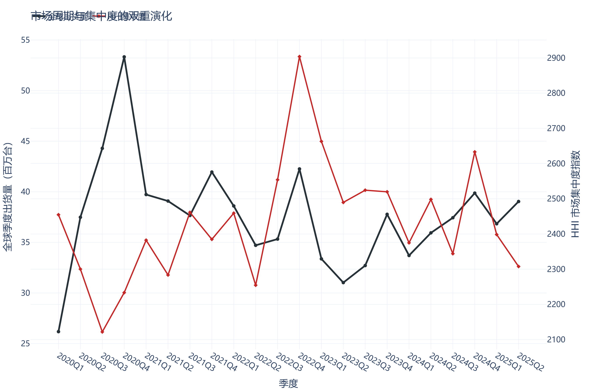
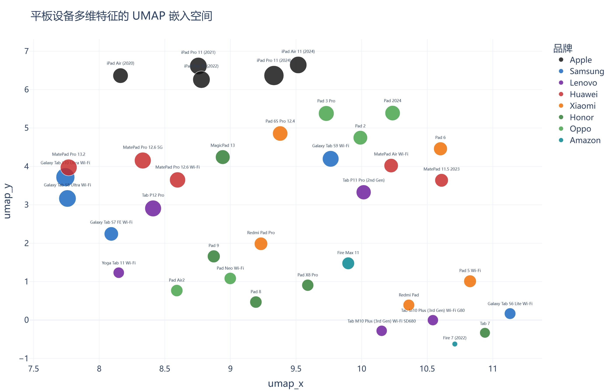
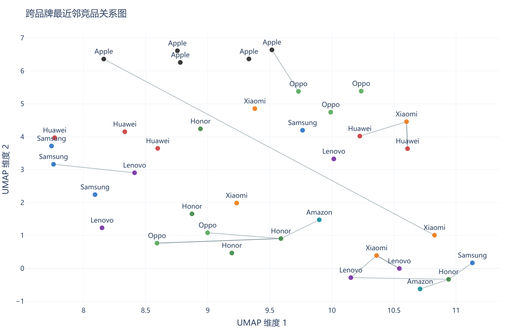
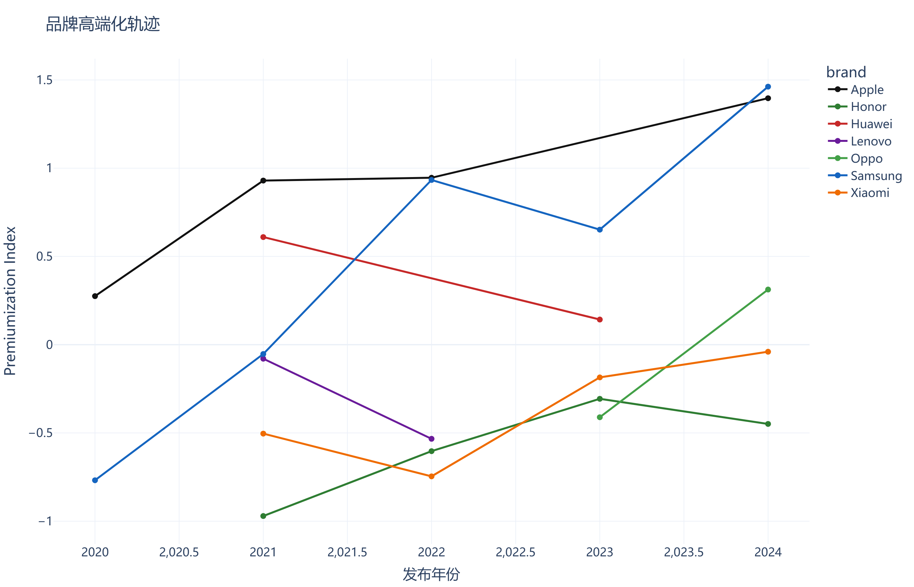
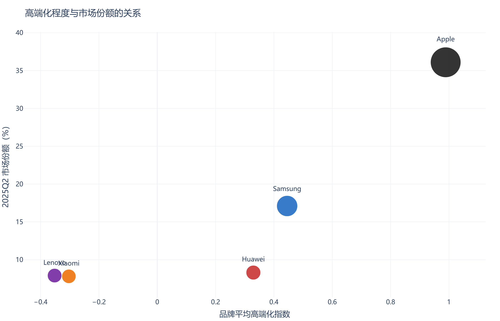
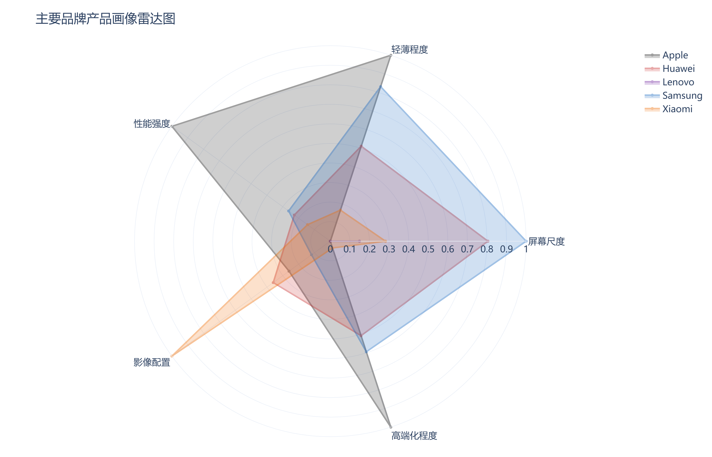

\begin{titlepage}
\centering
\vspace*{3cm}
{\Huge\bfseries Tablet Trajectories\par}
\vspace{0.8cm}
{\LARGE 2020-2025年平板电脑市场、产品形态与技术升级研究\par}
\vspace{1.8cm}
{\Large 可视化总结报告\par}
\vfill
{\large 基于 Canalys、DeviceSpecifications 与 Geekbench 的多源数据分析\par}
\vspace{1.2cm}
{\large 生成日期：2026-05-06\par}
\vspace*{2cm}
\end{titlepage}

\tableofcontents
\newpage

# 摘要

本报告围绕 `2020-2025` 年平板电脑行业的发展轨迹展开研究，试图在宏观市场、中观产品与微观性能三个层级之间建立一套可相互印证的分析框架。相较于将平板仅视为消费电子参数集合的常见做法，本研究更关注三个问题：第一，全球平板市场在疫情冲击与后疫情修复过程中经历了怎样的周期波动；第二，品牌之间的竞争格局是否与其产品路线存在结构性对应；第三，设备在性能、显示技术、外形与连接能力上的升级，能否被量化为一种可观测的“高端化轨迹”。

本项目整合了三类公开数据：`Canalys Newsroom` 的品牌级季度出货量与市场份额数据、`DeviceSpecifications` 的型号级硬件规格数据，以及 `Geekbench Browser` 的 SoC/设备级性能数据。研究在数据处理阶段完成了品牌-季度面板数据重建、设备特征标准化、复合高端化指数构建、UMAP 低维嵌入和最近邻竞品匹配等分析步骤，并最终将这些结果组织为一套图文结合的可视化报告。

研究结果表明，平板电脑在 `2020-2025` 年间并非简单经历“疫情繁荣后衰退”的单向过程，而是经历了“扩张—调整—恢复”的周期波动；与此同时，设备层面的高端化与产品分层趋势明显增强，尤其在 Apple、Samsung、Huawei、Xiaomi 等品牌中表现得更为突出。平板作为一种终端形态，正在从“大屏内容消费设备”进一步转向“兼具显示、创作与轻办公属性的综合型个人终端”。

\newpage

# 1. 研究问题与方法框架

本项目希望回答的核心问题包括：

1. 全球平板市场在 `2020Q1-2025Q2` 期间经历了怎样的周期波动与结构变化。
2. Apple、Samsung、Huawei、Lenovo、Xiaomi 等品牌在市场份额与产品升级路径上是否存在一致性。
3. 平板的外形、显示技术、性能与功能配置如何共同塑造产品分层。
4. 不同品牌之间的竞品关系，是否可以通过设备特征空间而非营销叙事来识别。

为了回答这些问题，项目采用以下方法路径：

- `品牌-季度面板数据重建`
- `设备特征标准化`
- `HHI 市场集中度测度`
- `UMAP 低维嵌入`
- `最近邻竞品匹配`
- `Premiumization Index 复合高端化指数`

这种方法组合的意义在于，它使项目不再局限于单张图表的直观展示，而能够在“市场结构—产品形态—技术能力”之间建立连贯的论证链条。

\newpage

# 2. 数据来源与处理逻辑

项目主要基于以下数据表展开：

- `tablet_market_2020_2025.csv`
- `tablet_models_2020_2025.csv`
- `tablet_perf_2020_2025.csv`
- `tablet_feature_space_final.csv`
- `tablet_nearest_neighbors_final.csv`

其中，市场数据用于构建时间序列与竞争结构分析；型号级规格数据用于建立设备特征矩阵；性能数据用于建立跨品牌可比较的算力尺度；而最终生成的 `feature_space` 与 `nearest_neighbors` 则分别承载设备在特征空间中的坐标及跨品牌竞品关系。

在数据处理层面，项目将设备的屏幕尺寸、机身厚度、重量、显示类型、后摄像头像素、单核分数、多核分数及功能标签共同编码为一个多维特征向量。由于这些变量量纲不同，因此在建模前进行了标准化处理。功能标签部分采用二值化编码方式，使 `Wi-Fi 6/7`、`USB-C`、`eSIM/5G` 等高阶功能能够进入统一分析空间。

此外，为了对“高端化”进行量化而非仅作印象判断，项目构建了一个由 `多核性能 + 显示技术等级 + 屏幕尺度 + 厚度反向值 + 高级连接能力` 共同组成的复合指数。该指数用于衡量品牌在研究周期内的产品升级方向和技术层级变化。

\newpage

# 3. 市场周期与集中度

{ width=96% }

图 1 展示了全球平板季度出货量与市场集中度指数的联合变化。左轴为季度总出货量，右轴为基于品牌市场份额计算得到的 `HHI`。这类双轴结构的意义在于，它避免了单纯以销量曲线来描述市场，从而能够同步观察“总量变化”与“竞争结构变化”之间的关系。

从出货量来看，`2020Q4` 对应疫情时期的阶段性高峰，显示出远程教育、家庭娱乐场景与轻办公需求对平板市场的强刺激。随后市场逐步进入调整期，并在 `2023` 年前后触及低位。从 `2024` 年起，市场恢复迹象逐渐显现，说明平板并未被更小尺寸或更高性能终端所替代，而是在新的场景组合中重新建立稳定需求。

从 `HHI` 来看，市场在多个阶段保持相对较高集中度，这意味着尽管参与品牌众多，但头部品牌主导地位始终强劲。换句话说，平板行业的变化并不是“所有品牌一起同步上升或下降”，而是在头部结构相对稳定的前提下进行的总量调整与中部竞争重组。

\newpage

# 4. 设备特征空间与产品分层

{ width=96% }

图 2 将代表型号的多维硬件特征通过 `UMAP` 投射到二维空间。图中的每个点不再只是某个品牌的产品标识，而是一个由外形、性能、显示技术与功能配置共同决定的设备特征位置。  

这一处理方式的关键优势在于，它将“设备之间是否相似”从直觉判断转化为了空间关系。如果两个设备在嵌入空间中相互接近，就意味着它们在多项核心特征上拥有更高的相似度。图中可以观察到明显的产品分层：高端平板如 iPad Pro、Galaxy Tab S10 Ultra、MatePad Pro 13.2 和 Pad 6S Pro 等设备，倾向于聚集在一类高性能、高配置区域；而入门或低价产品则分布在另一端。

这说明“高端平板”并不是品牌宣传中的抽象标签，而是一种能够在多维特征空间中被观测到的结构位置。平板行业内部存在清晰的层级分化，而这种分化同时受到性能、显示、外形和连接能力的共同影响。

\newpage

# 5. 竞品关系的特征空间识别

{ width=96% }

在特征空间建立之后，项目进一步采用 `Nearest Neighbor Matching` 方法，识别跨品牌最接近的设备对。图 3 将这些最近邻关系以网络化连线形式叠加在特征空间中，从而呈现出一种“结构化竞品关系图”。

这一分析的意义在于：它使竞品不再由市场宣传话语决定，而由设备之间真实的多维相似性决定。某些高端 Android 平板可能会更接近特定的 iPad 设备，而不是本品牌内部的中端机型；反之，一些强调性价比的平板也会在跨品牌层面形成相似性更强的聚类。这类关系帮助我们看到市场竞争背后更本质的一层，即品牌之间真正争夺的不是抽象的“市场份额”，而是用户在特定配置、体验和价格预期下的替代选择空间。

因此，这张图强化了一个重要判断：设备层面的竞争结构，与品牌层面的市场结构既相互关联，又并不完全重合。市场地位强，不代表每一类设备都拥有绝对替代性；技术相近，也不必然转化为同等的市场结果。

\newpage

# 6. 高端化轨迹

{ width=96% }

图 4 展示了各品牌在研究周期内的 `Premiumization Index` 变化轨迹。由于该指数同时吸收了性能、显示、连接能力、屏幕尺度与轻薄化因素，因此它并不是某一项参数的简单放大，而是品牌产品路线在综合意义上的量化表达。

从图中可以看出，Apple 的高端化水平在整个周期中维持在较高位置，并随着 M 系列芯片的引入继续强化。Samsung 与 Huawei 也展现出明显的高端旗舰路径，在 AMOLED/OLED、高性能 SoC 与大屏设备的组合上具有较强连贯性。Xiaomi 与 Oppo 的上升轨迹则反映出中国品牌在高端平板方向上的持续推进，它们不再仅停留于性价比市场，而是在更高配置层级争取结构位置。

这一图表的重要价值在于，它为“品牌是否正在高端化”提供了一种可追踪、可比较的量化依据。研究者不再需要依靠品牌印象做判断，而是可以直接观察一个品牌在时间上的技术升级方向和强度。

\newpage

# 7. 高端化程度与市场结果

{ width=94% }

图 5 将 `2025Q2` 的市场份额与品牌平均高端化指数放入同一张散点图中，同时使用气泡大小编码出货量规模。这使得图中同时包含三个维度：技术升级程度、市场占有率与实际规模。

图中最值得注意的是，Apple 同时占据高高端化和高市场份额的区域，说明其技术升级、产品能力与市场回报之间形成了较强的一致性。Samsung 虽然在高端化程度上也处于较高水平，但市场份额表现并未与 Apple 接近，说明 Android 平板在生态整合、品牌溢价和使用场景黏性方面仍存在差距。

Huawei、Xiaomi 等品牌则位于一个更有张力的位置：它们的高端化程度已经明显提高，但市场结构位置仍处于追赶阶段。这也提示出一个更成熟的结论：技术升级是市场竞争的重要前提，但并不是市场成功的唯一决定因素。生态能力、渠道体系和用户认知，仍然在平板产业中发挥关键作用。

\newpage

# 8. 品牌产品画像

{ width=82% }

图 6 以雷达图形式概括了 Apple、Samsung、Huawei、Xiaomi 和 Lenovo 在多个产品维度上的平均画像，包括屏幕尺度、轻薄程度、性能强度、影像配置和高端化程度。  

与前面的趋势图和散点图相比，这张图的作用不是展示时间变化，而是用来快速比较品牌的综合配置倾向。Apple 在性能和高端化上保持强势，Samsung 在多维度上分布均衡，Huawei 在高端化与大屏策略上具有鲜明特征，而 Xiaomi 与 Lenovo 则更清楚地表现出各自的产品取向：前者在高端追赶中增强配置密度，后者则更多保留主流大屏与实用性导向。

雷达图虽然不适合作为严格统计结论的唯一依据，但作为报告末段的结构收束图，它能够以更直观的方式帮助读者建立品牌路线的整体印象，使前文的时间序列、特征空间和竞品关系分析获得一个综合性的视觉总结。

\newpage

# 9. 结论

综合整套分析结果，可以形成以下几点判断：

1. `2020-2025` 年平板行业经历了完整的市场周期波动，即由疫情刺激带来的扩张、随后出现的需求回调，以及 `2024-2025` 年重新出现的恢复性增长。
2. 市场结构在总量波动中并未被彻底改写，Apple 始终占据强势主导位置，Samsung 保持稳定第二梯队，Huawei 与 Xiaomi 的后续上升则显示出中部竞争带的动态重组。
3. 如果从设备特征空间观察，平板市场内部存在明显的高端、中端与入门分层，而这种分层并非由单一指标决定，而是由外形、显示、性能与功能配置共同塑造。
4. 跨品牌竞品关系可以通过最近邻匹配识别出来，这意味着平板之间的竞争本质上是一种特征邻近竞争，而不只是品牌标签竞争。
5. 高端化确实是平板近五年的核心技术路线之一，但高端化程度与市场份额之间并不是简单线性关系，市场结果仍受到生态能力与品牌结构的深刻影响。

因此，平板电脑在 `2020-2025` 年间的发展，不应被理解为简单的参数升级，而应被理解为一种市场、技术与产品定位共同推动下的终端再组织过程。

\newpage

# 10. 研究局限与后续方向

尽管本项目已经引入了较为完整的方法结构，但仍存在若干局限：

1. 设备样本采用代表性抽样，而非全量市场样本。
2. 部分性能指标使用同 SoC 代理，因此更适合结构比较，而非严格设备实测。
3. 高端化指数权重目前仍为研究设定，未来可以通过 `PCA` 或因子分析进一步优化。
4. UMAP 嵌入具有一定参数敏感性，更适合用于结构探索而非唯一确定结论。

后续最值得补充的三个方向是：

- 引入价格变量，形成性能—价格—定位三角分析；
- 引入区域市场维度，比较中国与全球市场差异；
- 将当前静态报告拓展为交互式网页叙事系统，使设备特征空间和竞品关系可被用户动态探索。

# 11. 总结

这份报告试图证明，平板电脑数据并不只能被做成销量折线图或参数排行榜。只要在数据结构、方法路径和图表表达之间建立对应关系，它同样可以发展为一个具有研究意识的数据叙事项目。  

通过品牌-季度面板、设备特征空间、竞品匹配网络和高端化指数，平板行业在 `2020-2025` 年的变化被重新组织为一套更具解释力的结构。它不仅回答了“市场如何变化”，也进一步回答了“产品为什么如此分化”“技术升级如何影响市场结构”以及“品牌之间真正竞争的是什么”。这也使该项目从一般意义上的数据可视化，进一步靠近研究型设计与方法型作品的表达范式。
