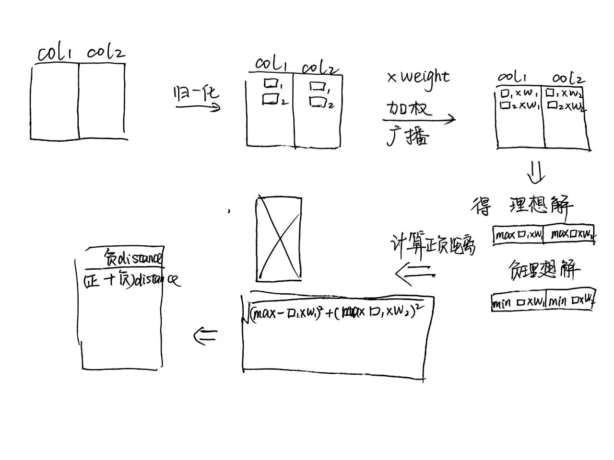

## 1. Topsis
### **关键步骤**
1. 归一化： $x_{ij}' = \frac{x_{ij}}{\sqrt{\sum x_{ij}^2}}$
2. 加权： $v_{ij} = x_{ij}' \times w_j$
3. 理想解： $A^+ = (\max v_{i1}, \max v_{i2}, \dots)$  
   负理想解： $A^- = (\min v_{i1}, \min v_{i2}, \dots)$
4. 距离：  
   $D_i^+ = \sqrt{\sum (v_{ij} - A_j^+)^2}$  
   $D_i^- = \sqrt{\sum (v_{ij} - A_j^-)^2}$
5. 接近度： $C_i = \frac{D_i^-}{D_i^+ + D_i^-}$

### **一句话总结**  
TOPSIS通过量化方案与理想/负理想解的距离，将多特征的评分转化为客观的几何距离比较。选最高的分就是最好的决策

## 2. 模糊综合评价
模糊综合评价只评价一件事物，只评价它**优秀、良好、一般、差**，模糊了打分，不评价有多优秀，有多好。

### **关键步骤**

1. **明确评价要素**：**确定因素集（U）**：列出所有评价指标。 *示例*：U = {教学质量, 科研水平, 师资力量, 校园环境}  。**确定评语集（V）**：定义评价等级。*示例*：V = {优, 良, 中, 差}

2. **构建模糊关系矩阵（R）**
对每个因素，统计其属于各评语的**隶属度**（通过专家打分或调查数据）。  
形成矩阵：列是V，行是U，隶属度其实就是教学质量有百分之多少人打了优，多少人打了良。
$$R = \begin{bmatrix}
    0.6 & 0.3 & 0.1 & 0.0 \\
    0.5 & 0.3 & 0.2 & 0.0 \\
    ... 
    \end{bmatrix}$$

3. **确定权重向量（W）**
分配各因素的权重（需满足 $\sum w_i = 1$ ）。权重可通过AHP、熵权法或专家打分确定。 

4. **模糊合成运算**
计算综合隶属度：$B = W \circ R$  
例如B = [0.5, 0.33, 0.13, 0.03]，0.5 最大说明是优秀，如果每个评价有分数的话，可以算得加权评分。

