## 2025.4.25
学习了决策树ID3算法，复习了信息熵和信息增益的概念
  - 要注意的是，信息增益 = 总信息熵 - 依据某特征分类后的加权信息熵
  - 但某特征的值是连续的，要将其化作离散值。

<details>
<summary><b>机器学习</b></summary>

## 1. 梯度下降法
梯度下降法(Gradient Descent)是一种得到函数**局部**最小值的算法。它通过沿着当前点梯度的反方向(即函数下降最快的方向)逐步调整参数，使目标函数值不断减小。
### 1.1 数学原理
对于目标函数J(θ)，梯度下降的更新规则为：
```
θ = θ - α·∇J(θ)，可以多参
```
其中：
- θ：待优化参数
- α：学习率(步长)
- ∇J(θ)：目标函数在θ处的梯度


### 1.2 算法步骤
1. 随机初始化θ
2. 计算当前θ处的梯度∇J(θ)
3. 按照更新规则调整参数
4. 重复步骤2-3直到满足停止条件
5. 注意，如果是多参，J(w,b)，那更新时不能先后更新，要用旧数据同时更新

## 2. 特征向量化
在python中用numpy实现特征向量化，可以引用到线性代数的知识。
### 2.1 为什么向量化
对于一个多特征输入(w),如果要进行累加和计算，需要进行多次循环，效率低下。   
**向量化**：可以一次性计算所有输入的累加和，大大提高效率。

## 3. 特征缩放
如果你有多个特征，如果特征尺度差异大（例如：年龄 [0,100] vs. 收入 [0,1,000,000]），就需要缩放。  
- **作用**：对于用梯度下降优化的模型来说，这么做能加速梯度下降收敛。  
未缩放时，损失函数的等高线呈“狭长椭圆形”，梯度下降会反复震荡（如右上图）；缩放后等高线更接近圆形，优化路径更直接（如右下图）。  
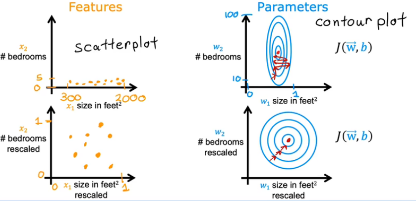  
### 3.1 特征缩放方式
- **均值归一化（Mean Normalization）**：减去均值使均值移动到0，然后除以极差，使得每个特征的取值范围变为[-1,1]。
- **Z值归一化（Z-score Normalization）**：将每个特征变成标准正态分布，即均值为0，标准差为1。

#### 3.1.1 均值归一化公式
$$x_i = \frac{x_i - \mu_i}{max-min}$$
- $\mu_i$：第 $i$ 个特征的均值，是样本均值不是最大最小值相加除以2.
- $max$：样本最大值
- $min$：样本最小值

#### 3.1.2 Z值归一化公式

$$x_i = \frac{x_i - \mu_i}{\sigma_i}$$

- $\mu_i$：第 $i$ 个特征的均值
- $\sigma_i$：第 $i$ 个特征的标准差

## 4. 正则化线性回归 (Regularized Linear Regression)
### 4.1 损失函数
$$\min_{\hat{w},b} J(\hat{w},b) = \min_{\hat{w},b} \left[ 
\frac{1}{2m}\sum_{i=1}^{m}(f_{\hat{w},b}(\vec{x}^{(i)}) - y^{(i)})^2 + 
\frac{\lambda}{2m}\sum_{j=1}^{n}w_{j}^2 
\right]$$

### 4.2 它的梯度下降
**参数更新（同时进行）**：
- **权重 $w_j$ 更新：**
$$w_j = w_j - \alpha \frac{\partial}{\partial w_j}J(\hat{w},b) \Rightarrow 
w_j - \alpha \left[ 
\frac{1}{m}\sum_{i=1}^{m}(f_{\hat{w},b}(\vec{x}^{(i)}) - y^{(i)})x_{j}^{(i)} + 
\frac{\lambda}{m}w_j 
\right], \quad j=1,\cdots,n$$

- **偏置 $b$ 更新：**
$$b = b - \alpha \frac{\partial}{\partial b}J(\hat{w},b) \Rightarrow 
b - \alpha \left[ 
\frac{1}{m}\sum_{i=1}^{m}(f_{\hat{w},b}(\vec{x}^{(i)}) - y^{(i)}) 
\right]$$

- $w_j$: 第 $j$ 个特征的权重
- $\alpha$: 学习率（learning rate）
- $\lambda$: 正则化系数
- $m$: 训练样本数量
- $f_{w,b}(\vec{x}) = w^T\vec{x} + b$: 线性模型预测值
- $\vec{x}^{(i)}$: 第 $i$ 个样本的特征向量
- $x_j^{(i)}$: 第 $i$ 个样本的第 $j$ 个特征值

### 4.3 分析
由
$$w_j = w_j - \alpha \frac{\partial}{\partial w_j}J(\hat{w},b) \Rightarrow 
w_j - \alpha \left[ 
\frac{1}{m}\sum_{i=1}^{m}(f_{\hat{w},b}(\vec{x}^{(i)}) - y^{(i)})x_{j}^{(i)} + 
\frac{\lambda}{m}w_j 
\right], \quad j=1,\cdots,n$$

整理得到

$$w_j = \left(1 - \frac{\alpha\lambda}{m}\right)w_j - \alpha\frac{1}{m}\sum_{i=1}^{m}\left(f_{w,b}(\vec{x}^{(i)}) - y^{(i)}\right)x_j^{(i)}$$

前面的 $\left(1 - \frac{\alpha\lambda}{m}\right)w_j$ 这一项将衰减 $w_j$ 的值，因此正则化的作用其实就是让权值w不要那么的大。


## 5. 过拟合解决方法
- **增加数据量**：增加数据量可以解决过拟合问题。
- **减少特征数量**：适当减少特征数量可以解决过拟合问题。
- **正则化**：正则化是一种约束方法，可以防止过拟合

### 5.1 减少特征数量
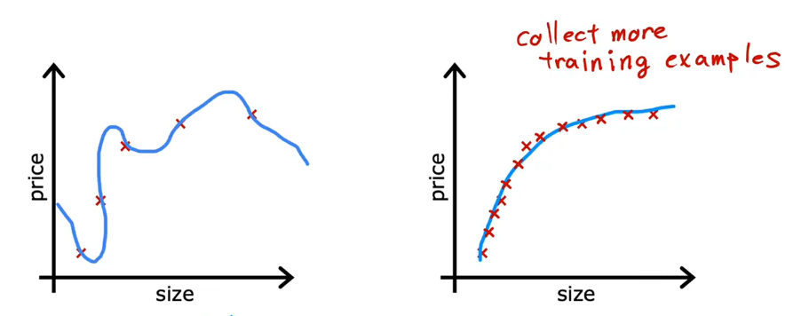  
不是所有的特征都是有用的，适当扔弃部分特征可以让你没过拟合。左图使用了太多特征，右图就好一点。
### 5.2 正则化
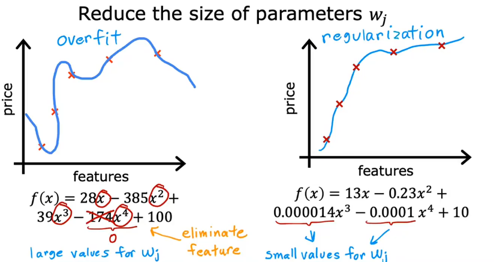  
你知道特征都是有用的，不去丢弃，那么你用正则化就能缩小这些高次项的系数。不去依赖过多那些特征。

### 5.3 带正则化的损失函数
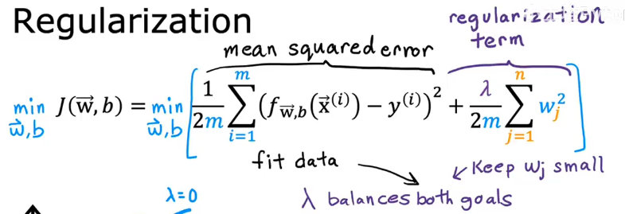  
可见这里多了一项，前半称为均方误差项，后半称为正则化项，λ是正则化参数。

- λ太小，则容易过拟合
    - 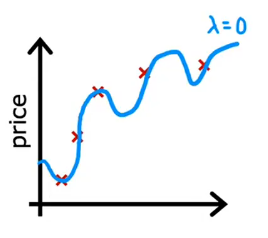
- λ太大，则权重太小，变成只有b的函数
    - 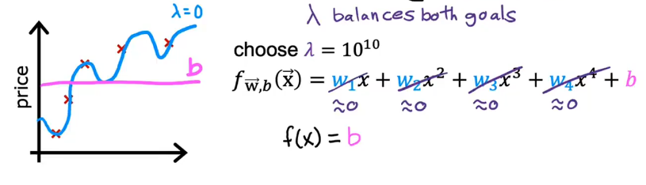   
因此λ要控制好 

## 6. 逻辑回归
**motivation**:在二分类问题中，线性回归无法解决x坐标趋近于无穷的问题，倘若说f(x) = 0.5 是决策边界的话，那么当x -> +∞，那就会导致很多该被判为 1 的样本被判为0。  
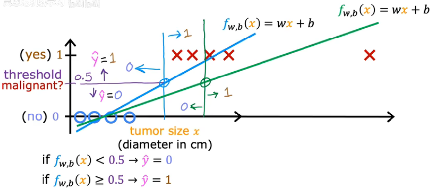
### 6.1 逻辑回归模型
- **本质**：一种用于**二分类**（可扩展至多分类）的统计学习方法，输出为概率值（0~1）。
- **核心思想**：通过线性回归结合Sigmoid函数，将连续值映射为概率。  

**sigmoid公式**：
- **线性部分**：  
  $$z = w^T x + b$$  
  （w为权重，b为偏置，x为特征向量）
- **Sigmoid函数**：  
  $$\sigma(z) = \frac{1}{1 + e^{-z}}$$ 
  将z映射到 `(0,1)`，表示概率P(y=1 | x) 。


### 6.2 决策边界
- **二分类规则**：  
  - 若 $sigma(z) \geq 0.5$，预测  $y=1$ ；  
  - 若 $\sigma(z) < 0.5$ ，预测 $y=0$。  
- **边界形式**：  
  其实就是 $w^T x + b = 0$


### 6.3 损失函数
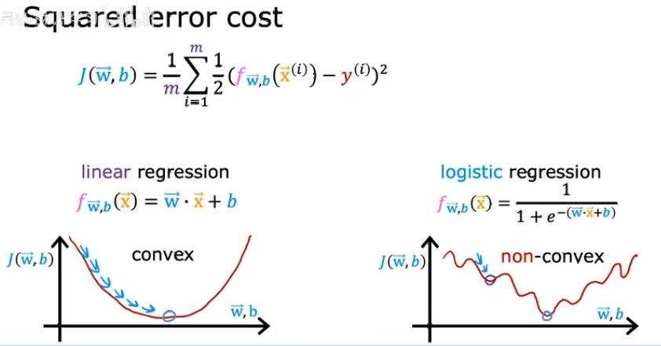   
由于逻辑函数如果代入平方损失函数，将会得到一个非凸函数，使得梯度下降法会局部最优。因而要寻求别的损失函数。
#### 6.3.1 **交叉熵损失（Log Loss）**：
这个Loss函数的原理是最大似然估计，而且logic函数在该Loss函数下是凸函数，因此可以用梯度下降法进行优化。  
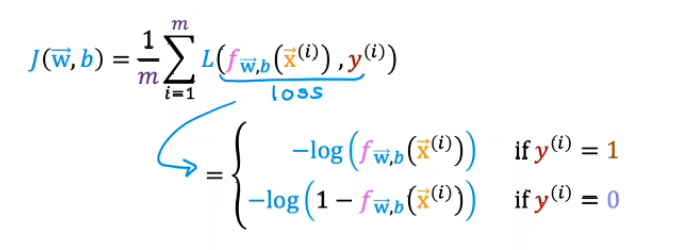  
$$J(w, b) = -\frac{1}{m} \sum_{i=1}^m \left[ y^{(i)} \log(\sigma(z^{(i)})) + (1-y^{(i)}) \log(1-\sigma(z^{(i)})) \right]$$
- 当 $y^{(i)} = 1 时$ ，Loss函数如图，越靠近1，Loss越小；若靠近0，则Loss趋近于+∞，驱使模型做出修改
  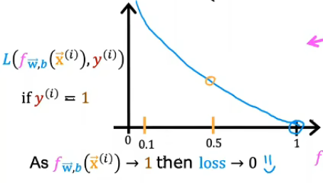
- 当 $y^{(i)} = 0 时$ ，Loss函数如图，越靠近0，Loss越小；若靠近1，则Loss趋近于+∞，驱使模型做出修改
  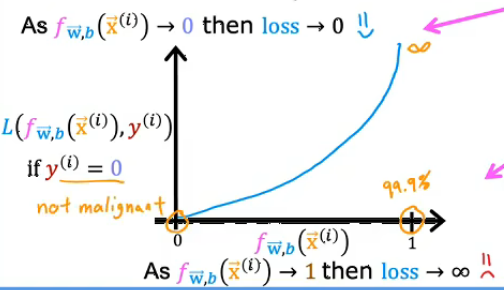

#### 6.3.2 **参数调优**
**梯度下降法**：    
$$w = w - \alpha \frac{\partial J}{\partial w}$$

$$\quad b = b - \alpha \frac{\partial J}{\partial b}$$

**梯度计算**：  

$$\frac{\partial J}{\partial w_j} = \frac{1}{m} \sum_{i=1}^m (\sigma(z^{(i)}) - y^{(i)}) x_j^{(i)}$$

**偏差计算**：  

$$\frac{\partial J}{\partial b} = \frac{1}{m} \sum_{i=1}^m (\sigma(z^{(i)}) - y^{(i)})$$   

其实和线性回归长的一模一样

</details>

<details>
<summary><b>神经网络</b></summary>

## 1. 神经元和大脑
模仿生物神经网络的数学模型，通过多层非线性变换实现输入到输出的映射。其实现代的很多神经网络，深度学习都已经跟最初的生物神经网络有了很大的不同，但是大伙乐意叫这个名字。
### 1.1 基础用语
- **前向传播**：数据从输入层流向输出层的过程。
- **反向传播**：通过链式法则计算梯度并更新参数。
- **前馈神经网络**：主要通过前向传播，层层先后。
- **循环神经网络**：如果一个神经元传播时还要调整自身参数，则属于循环神经网络。
- **图神经网络**：如果是由一个图构成的，则为图神经网络。
### 1.2 深度学习的兴起
近年来，互联网的普及使得能获取的数据量变多了，在行业的模型性能就提升的很快。从下至上分别是传统ai，小型神经网络，中型神经网络，大型神经网络。若能搭建大型神经网络并配上大量数据，那就很厉害了。
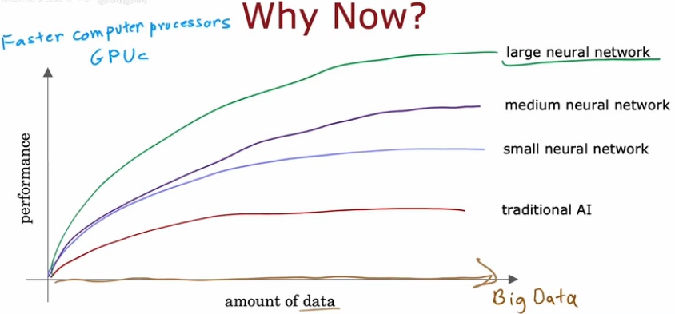

## 2. 神经网络
- **输入层**：数据中(x,y)就是输入层的输入。
- **隐藏层**：x的标签是y，如果说x先标签到z，再从z标签到y。那么隐藏层就是z，它是未知的隐藏的，无法确认正误的。比如说(价格，运费)->(口碑)->(销量)
- **输出层**：数据中y就是输出层的输出。
- **神经元**：每一个神经元都是一个逻辑回归单元，接受前一层的激活值a，经过sigmoid函数激活，输出当前层的激活值。
- **激活值(activation)**:激活值就是神经元的输出，它是一个介于0和1之间的数。

### 2.1 神经网络的层
从输入层开始，输入层是第0层，也就是不在该网络的那层。
#### **2.1.1. 权重 w 的上下标**
- **表示形式**： $w^{[l]}_{jk}$
  - **上标 $[l]$**：表示第 $l$ 层（即第 $l$ 个隐藏层或输出层）。
  - **下标 $jk$**：
    - $j$ ：当前层（第 $l$ 层）的第 $j$ 个神经元。
    - $k$ ：前一层（第 $l-1$ 层）的第 $k$  个神经元。
  - **物理意义**：从第 $l-1$ 层的第 $k$ 个神经元到第 $l$ 层的第 $j$ 个神经元的连接权重。

- **矩阵形式**： $w^{[l]}_{j}$
  - $j$ ：当前层（第 $l$ 层）的第 $j$ 个神经元的偏重向量

#### **2.1.2. 权重 b 的上下标**
- **表示形式**： $b^{[l]}_j$
  - **上标 $[l]$**：表示第 $l$ 层。
  - **下标 $j$**：第 $l$ 层的第 $j$ 个神经元的偏置。  

激活值推导函数：   
  
$$a^{[l]}_j = g(w^{[l]}_j a^{[l-1]} + b^{[l]}_j)$$  

**知识回顾**：以前在机器学习的时候，标记上下标的是x，为 $x^{(i)}_j$ ,表示第 $i$ 个样本的第 $j$ 个特征。上标比的是不同样本的x，现在对w，b进行上下标，比的是不同层的w，b。  
以前只有一组w，b，现在由于每个神经元都是一个逻辑回归单元，所以有一堆w，b。

## 3. tensorflow
### 3.1 tensorflow中的数据
np.array()最外层一定只能是'[]'
- **向量（行向量）**
$x = np.array([1, 2, 3])$ ，形状为(3,)  
只有一个'[]',最外层[]框住的每个单元都是一个元素，形状为(3,)
- **矩阵（二维数组）**
$x = np.array([[1, 2, 3]])$ 形状为(1,3)
$x = np.array([[1, 2, 3], [4, 5, 6]])$ ，形状为(2,3)  
有两个'[]',最外层[]框住的每个单元都是一个向量
- **张量（三维数组）**
$x = np.array([[[1, 2, 3], [4, 5, 6]], [[7, 8, 9], [10, 11, 12]]])$ ，形状为(2,2,3)  
有三个'[]',最外层[]框住的每个单元都是一个矩阵

### 3.2 tensorflow中的转换
由于历史的原因，numpy和tensorflow数据互通需要转换
**array.numpy()** :将tensor转换为numpy数组

### 3.3 利用tensorflow创建神经网络
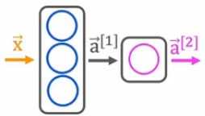
#### 3.3.1 显式调用
```python
x = np.array([[200.0,17.0]])
layer_1 = Dense(units=3, activation='sigmoid')
a1 = layer_1(x)

layer_2 = Dense(units=1, activation='sigmoid')
a2 = layer_2(a1)
```
如此，手动地一层一层调用完成
#### 3.3.2 利用Sequential()函数
sequential()是一个顺序函数，能帮你自动连接网络，按照顺序调用层
```python
layer_1 = Dense(units=3, activation='sigmoid')
layer_2 = Dense(units=1, activation='sigmoid')
model = Sequential([layer_1, layer_2])
```

### 3.4 利用tensorflow的简化操作
```python
# 搭建一个简单的神经网络
import tensorflow as tf
from tensorflow.keras.layers import Dense
from tensorflow.keras.models import Sequential

model = Sequential([
    Dense(units=3, activation='sigmoid', input_shape=(2,)),
    Dense(units=1, activation='sigmoid')
])

# 定义loss函数，编译并训练
from tensorflow.keras.losses import BinaryCrossentropy

model.compile(loss=BinaryCrossentropy())    # 交叉熵loss
model.fit(x_train, y_train, epochs=100)   # 训练
```


## 4. 自己实现前向传播
### 4.1 在一个单层中的前向传播(事例)：
.png)  
就是每一个一个神经元去算去激活
### 4.2 前向传播的一般实现
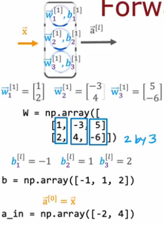  
设计dense()函数:
- **输入**
  - 权重 $W$ ，如图，将该层每个神经元的w先转为列向量，然后再拼起来，得到矩阵 $W$
  - 偏置 $b$ , 如图，将该层每个神经元的b拼起来，得到向量 $b$
  - 激活函数 $g$
  - 输入 $a_{in}$
- **输出**
  - 输出向量 $a_{out}$ , 就是激活值向量
```python
def dense(a_in, W, b, g):
    units = W.shape[1]
    a_out = np.zeros(units)
    for j in range(units):
        w = W[:, j]
        z = np.dot(w, a_in) + b[j]
        a_out[j] = g(z)
    return a_out
```
设计sequential()函数:
- **输入**：输入层输入 x 数据
- **输出**： 输出层输出 y

```python
def sequential(x):
    a1 = dense(x, W1, b1, g)
    a2 = dense(a1, W2, b2, g)
    a3 = dense(a2, W3, b3, g)
    a4 = dense(a3, W4, b4, g)
    f_x = a4
    return f_x
```

### 4.3 利用矩阵高效实现
```python
def dense(a_in, W, B, g):
    Z = np.matmul(W, a_in) + B    % 利用矩阵乘法，格式就要像线性代数那样
    A_out = g(Z)
    return A_out
```

## 5. 激活函数
如何选取主要是看你想实现什么。如果二分类，用Sigmoid；
如果输出非负数，用Relu；如果有正有负，用linear activation function。
### 5.1 常见的激活函数
- **Relu**
- **Sigmoid**
- **linear activation function**
#### 5.1.1 Relu
$$f(x) = max(0, x)$$

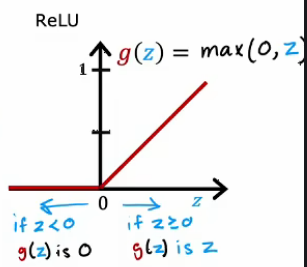
#### 5.1.2 Sigmoid
$$f(x) = \frac{1}{1+e^{-x}}$$

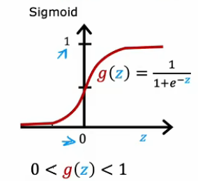
#### 5.1.3 linear activation function
$$f(x) = x$$


### 5.2 为什么我们需要激活函数
用激活函数，是为了和以前的线性回归，逻辑回归不一样。能学到更多特征  
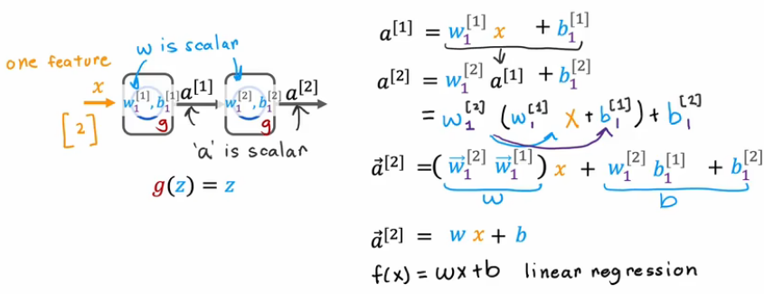  
假如说，在所有隐藏层都使用线性激活函数，那么整个神经网络就是一个线性回归模型。这就没有任何意义了。  

**知识点**: 隐藏层不要全用线性函数去激活

## 6. 多类问题
多分类问题，就是单选题，一个事物只能选择一个类并属于它。  
要区别于**多标签问题**，是多选题，一个事物可以有多个标签，也可以没有标签。  
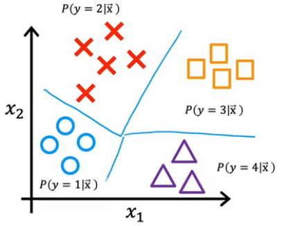
### 6.1 Softmax
  
$$g(\mathbf{z})_i = \frac{e^{z_i}}{\sum_{j=1}^K e^{z_j}}, \quad i = 1, 2, \ldots, K$$   

在输出端，所有输出值 $g(\mathbf{z}_i) \in (0, 1)$ 且和为 1。
### 6.2 Softmax的损失函数
被称作稀疏类别交叉熵函数
```python
from tensorflow.keras.losses import SparseCategoricalCrossentropy

model.compile(loss=SparseCategoricalCrossentropy(from_logits=True))     # from_logits=True是优化，避免单独计算 softmax 时的指数溢出风险。
```  
 
$$\operatorname{loss}\left(a_{1},\ldots, a_{N},y\right)=\left\{\begin{array}{ll}
-\log a_{1} & \text{if } y=1 \\
-\log a_{2} & \text{if } y=2 \\
\vdots & \vdots \\
-\log a_{N} & \text{if } y=N
\end{array}\right.$$  

由上一节，已知 $\mathbf{a}_i \in (0, 1)$ ， 所以当正确值是某一类时， $a_i$ 越靠近1，损失越小。  
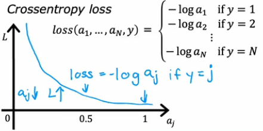
### 6.3 多类和多标签的区别
在代码方面，多类问题用softmax去激活
```python
Dense(num_classes, activation='softmax')
```
而多标签问题用sigmoid去激活
```python
Dense(num_classes, activation='sigmoid')
```

尽管输出层都是多个units，但是多类问题要单选出最可能的一类，而多标签问题可以有多个标签，只关注那些标签 **有** 或 **没有**。

## 7. 高级优化方法
### 7.1 adam 优化
- 使用梯度下降法最小化loss时，如果学习率太小，会走的慢。学习率太大，会震荡。因此用 adam 优化器能够 **自动调整学习率** ，使得模型在训练过程中更加稳定。
- 而且，**不只有一个学习率**，有几个参数就有几个学习率，彼此之间单独处理。

```python
# 可以更改初始化的学习率，让你更快地练模型
model.compile(optimizer= tf.kears.optimizers.Adam(learning_rate=1e-3), loss=tf.keras.losses.SparseCategoricalCrossentropy(from_logits=True))
```
## 8. 模型评估
先定义好损失函数loss，将数据集分为三个部分。  
- **训练集**：相当于平时练习
- **验证集**：相当于模拟考，为了看某一系列模型中谁最好，如果不对比一系列模型则不需要该集。
- **测试集**：评估模型的泛化能力。

### 8.1 定义评估的函数
如果loss是
$$J(w, b) = \min_{\hat{w},b} \left[ 
\frac{1}{2m}\sum_{i=1}^{m}(f_{\hat{w},b}(\vec{x}^{(i)}) - y^{(i)})^2 + 
\frac{\lambda}{2m}\sum_{j=1}^{n}w_{j}^2 
\right]$$

那么去掉正交项，就是 $J_{train}(w, b)$ 、 $J_{test}(w, b)$ 、 $J_{cv}(w, b)$ 。  

如果loss是
$$J(w, b) = \min_{\hat{w},b} \left[ 
\frac{1}{2m}\sum_{i=1}^{m}(f_{\hat{w},b}(\vec{x}^{(i)}) - y^{(i)})^2 + 
\frac{\lambda}{2m}\sum_{j=1}^{n}w_{j}^2 
\right]$$

$$J(w, b) = -\frac{1}{m} \sum_{i=1}^m \left[ y^{(i)} \log(\sigma(z^{(i)})) + (1-y^{(i)}) \log(1-\sigma(z^{(i)})) \right] + \frac{\lambda}{2m}\sum_{j=1}^{n}w_{j}^2  $$
那么去掉正交项，就是 $J_{train}(w, b)$ 、 $J_{test}(w, b)$ 、 $J_{cv}(w, b)$ 。  

### 8.2 对比一系列模型
只看**训练集**和**交叉验证集**，不看测试集，因为测试集是用来评估模型的泛化能力的，不是用来模型对比的。  
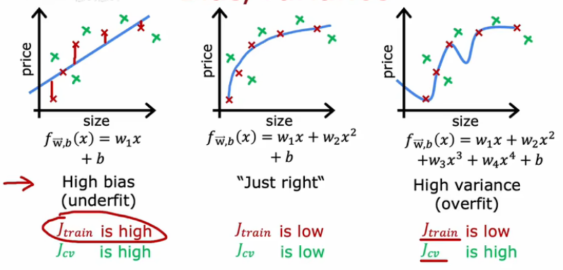  
- 好的模型， $J_{cv}$ , $J_{train}$ 都很小
- 欠拟合模型， $J_{cv}$ , $J_{train}$ 都很大
- 过拟合模型， $J_{cv}$ 很大， $J_{train}$ 很小  

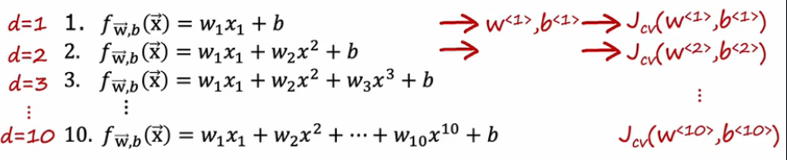  
要是有一堆模型，挑选的时候，就看他们的 $J_{cv}$ ， $J_{cv}$ 最小的模型，它在这系列模型是最好的。

### 8.3 验证集帮助模型评估
- $J_{train} ≈ J_{cv}$ 且 $J_{train}$ 很大，说明欠拟合，在图的左边
- $J_{cv} \gg J_{train}$ 且 $J_{train}$ 很小，说明过拟合，在图的右边
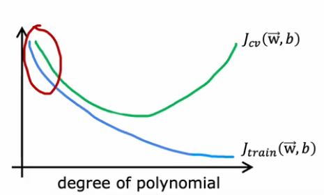  

### 8.4 建立表现基准
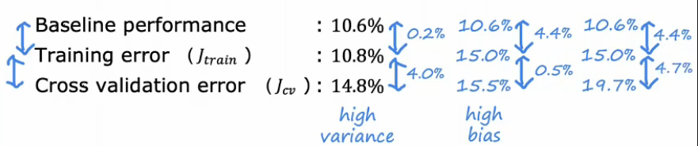  
在判断是否为高偏差和高方差的时候，需要一个基准。如果 $J_{train} - 基准$ 和  $J_{cv} - J_{train}$ 都够小，就说明模型很好

### 8.5 正则化偏差和误差
这一节，说白了，就是通过试错的方式找到合适的 $\lambda$ 。  
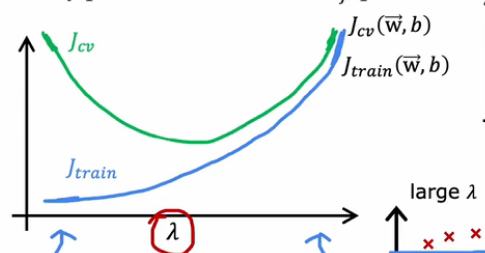  
- 正则化偏差： $\lambda$ 太小，模型过拟合
- 正则化误差： $\lambda$ 太大，模型欠拟合

多试错，找到中间的那个 $\lambda$ ，此时 $J_{train} ≈ J_{cv}$

找到了之后，就可以在使用模型时，用这个 $\lambda$ 去训练模型。
```python
Dense(num_classes, activation='sigmoid', kernel_regularizer=tf.keras.regularizers.l2(0.01))
```

多增加一个`kernel_regularizer=tf.keras.regularizers.l2(0.01)` 是为了让模型以正则化的方式防止过拟合。

</details>
