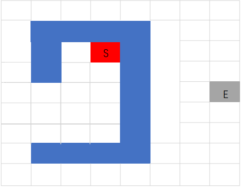
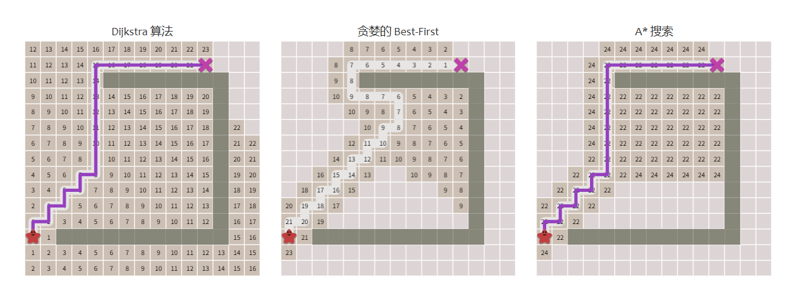
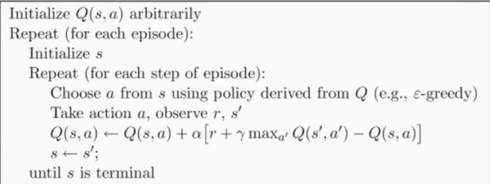
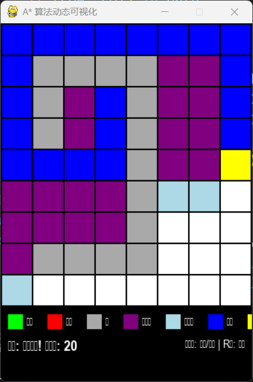
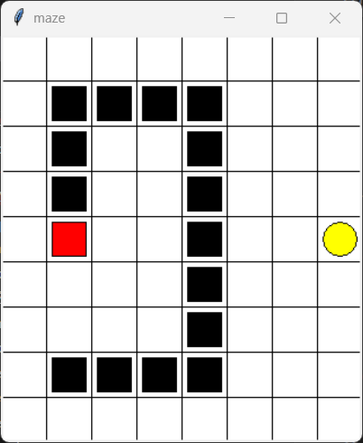

# 基于 A* 与 Q-learning 算法的迷宫路径规划系统
</center>

**姓名**: 李盛鹏 &nbsp;&nbsp;&nbsp;&nbsp;&nbsp;&nbsp;&nbsp;&nbsp;&nbsp;&nbsp;&nbsp;&nbsp;&nbsp;&nbsp;&nbsp;&nbsp;&nbsp;**学号**: 2351136  &nbsp;&nbsp;&nbsp;&nbsp;&nbsp;&nbsp;&nbsp;&nbsp;&nbsp;&nbsp;&nbsp;&nbsp;&nbsp;&nbsp;&nbsp;&nbsp;&nbsp;**日期**: 2025年4月19日

---
## 目录

1. [问题概述](#问题概述)
2. [算法设计](#算法设计)
3. [算法实现](#算法实现)
4. [实验过程与结果分析](#实验过程与结果分析)
5. [总结与分析](#总结与分析)

---

## 一、问题概述

### 1. 背景与意义

迷宫问题是经典的路径规划问题，广泛应用于自动导航、机器人控制、智能决策等领域。它不仅是算法和计算机科学中的经典问题，也在实际生活中有着重要的应用。例如，在自动驾驶中，车辆需要根据道路信息和环境变化选择最优路径；在机器人技术中，机器人需要根据环境的地图和障碍物进行路径规划，以完成任务。随着人工智能和机器学习技术的不断发展，路径规划算法在处理越来越复杂的任务时，发挥了越来越大的作用。

在这些路径规划算法中，传统的图搜索算法（如 A* 算法）和基于强化学习的算法（如 Q-learning）是最常用的两种方法。A* 算法通过启发式搜索策略在保证最优路径的同时，提供了较高的搜索效率；而 Q-learning 则通过智能体与环境的交互，逐步优化决策过程，在面对复杂和动态环境时，能够自适应地找到最佳路径。随着任务和环境复杂性的增加，这两种算法都展示出了各自的优势，并且越来越多地被用于实际问题的求解。

在本项目中，我选择了这两种算法来解决迷宫路径规划问题。通过 A* 算法和 Q-learning 算法，分别探索不同的路径规划方法。以下是使用的迷宫示意图：  


在这个迷宫中，目标是从起点找到一条通向终点的最短路径。迷宫中可能存在障碍物，这些障碍物会阻挡路径的通行。A* 算法通过启发式搜索，在每一步都评估当前路径的代价和到目标的预计代价，从而选择代价最小的路径进行扩展。由于其高效性和较低的计算复杂度，A* 算法成为了路径规划领域的标准算法，尤其适用于已知地图的静态环境。

Q-learning 算法则是基于强化学习的一种算法，它通过智能体与环境的交互来学习最优策略。在本项目中，智能体会从起点开始，在迷宫中进行随机探索，并根据与环境交互的反馈（奖励和惩罚）不断优化自己的路径选择。随着训练的进行，Q-learning 会逐渐学习到从起点到终点的最优路径，甚至在面对动态变化的迷宫时，Q-learning 也能做出适应性的调整。

本项目的目标是设计并实现一个迷宫路径规划系统，分别使用 A* 算法和 Q-learning 强化学习算法来解决路径寻找问题。在此过程中，我还将通过图形界面进行动态展示，让用户直观地看到这两种算法如何在迷宫中执行，从而帮助理解算法的工作原理和性能表现。

通过图形界面，用户能够观察到：
- A* 算法如何在搜索过程中根据启发式函数引导路径扩展。
- Q-learning 算法如何通过与环境的多次交互逐步优化路径选择。

这种动态展示不仅帮助理解算法的执行步骤，也便于直观比较 A* 算法和 Q-learning 算法在不同环境和任务下的表现差异。


### 2. 项目目标

本项目的主要目标是开发一个基于图形化界面的迷宫路径搜索系统，支持以下功能：

1. **使用 A* 算法进行迷宫的路径规划**：系统通过 A* 算法实现路径搜索。在已知的迷宫环境中，A* 算法能够高效地找到从起点到终点的最短路径。通过启发式函数（如曼哈顿距离），A* 算法在每一步选择总代价最小的节点进行扩展，确保路径的最短性。系统将实时显示搜索过程中的每一步路径扩展，并展示最终的最优路径。

2. **使用 Q-learning 强化学习算法进行路径学习**：系统还实现了 Q-learning 算法，利用强化学习的方式让智能体在与环境的交互中学习最优路径。通过不断地试错，智能体积累经验并逐步优化路径规划策略。在训练过程中，智能体通过奖励和惩罚来调整其决策，从而找到从起点到终点的最优路径。通过 Q-learning，系统可以展示路径选择的逐步优化过程，直观地展示智能体如何在复杂迷宫中逐渐找到有效路径。

3. **提供实时的迷宫状态显示**：系统支持实时更新迷宫的状态，展示当前的搜索进度，包括已探索区域、当前节点以及已找到的路径。用户能够看到 A* 算法如何一步步扩展最短路径，Q-learning 如何通过与环境交互更新路径选择。这些信息帮助用户清晰地理解每种算法的执行步骤。

4. **动态展示两种算法的执行过程，并比较其性能**：系统支持动态展示 A* 算法和 Q-learning 算法的执行过程，用户可以在同一迷宫中对比两种算法的搜索路径和性能差异。通过实时可视化，用户能够清晰地看到每种算法的搜索路径、执行效率及其在不同环境下的表现。系统还能够提供算法执行的统计数据，例如搜索时间、路径长度等，帮助用户深入理解每种算法的优缺点。

通过这些功能，本项目不仅提供了迷宫路径规划的基本解决方案，还通过图形化展示让用户能够直观地对比 A* 算法与 Q-learning 强化学习算法在路径搜索中的表现，为进一步的研究和应用提供了有价值的参考。


### 3. 问题的直观描述

迷宫问题通常是这样描述的：在一个二维网格中，给定一个起点和终点，需要找到一条从起点到终点的最短路径。在这个过程中，迷宫中可能会有障碍物（也就是墙），这些障碍物会阻碍路径的通行。这个问题的关键难点在于，如何高效地找到从起点到终点的最短路径，尤其是在迷宫规模较大或者障碍物复杂的情况下。

本系统采用了两种不同的路径搜索方法：
- **A* 算法**：它使用启发式搜索的方式，通过同时考虑路径的实际代价和到目标的预计代价，帮助快速找到最短的路径。  

- **Q-learning 算法**：这种方法基于强化学习，智能体通过与环境的不断互动，逐步更新自己的策略，最终自主找到最优路径。  


### 4. 总体解决思路概述

- **A* 算法**：A* 算法是一种图搜索算法，它通过每次扩展代价最小的节点，结合启发式函数（比如曼哈顿距离），能够高效地找到最短路径。在本项目中，A* 算法通过维护一个优先队列来动态地选择最有可能到达目标的路径，从而实现快速搜索。
  
- **Q-learning 算法**：Q-learning 是一种强化学习算法，智能体通过与环境的互动，持续更新状态-动作价值表，最终学习到从起点到终点的最优路径。在多轮试错的过程中，Q-learning 让智能体自主探索并找到通向目标的路径。

系统的实现包括以下步骤：
1. 加载迷宫地图；
2. 使用 A* 算法或 Q-learning 算法寻找路径；
3. 动态可视化算法执行过程，展示路径搜索的进展。

---

## 二、算法设计

### 1. A* 算法设计

A* 算法是一种启发式搜索算法，它在寻找路径时，既考虑了从起点到当前位置的代价，也考虑了到目标的距离。这样，A* 算法能够很好地平衡搜索效率和路径质量，因此广泛应用于路径规划、游戏开发和人工智能等领域。


#### 1.1 算法原理

A* 算法是一种基于图搜索的方法，它通过维护一个优先队列，动态地选择代价最小的节点进行扩展。每个节点都有一个代价函数 𝑓(𝑛),这个函数由两部分组成：
- **g(n)**：从起点到当前节点的实际代价。
- **h(n)**：当前节点到目标的估计代价，通常使用启发式函数来计算。

代价函数 \( f(n) \) 被定义为：

\[
f(n) = g(n) + h(n)
\]

其中：
- \( g(n) \) 是从起点到当前节点的代价，可以通过路径的长度、消耗的时间等衡量；
- \( h(n) \) 是启发式估计，表示从当前节点到目标的估计代价，通常使用曼哈顿距离或欧几里得距离作为启发式函数。

A* 算法的执行步骤如下：
1. 初始化一个开放列表，包含起点；
2. 从开放列表中选取代价 \( f(n) \) 最小的节点进行扩展；
3. 如果当前节点为目标节点，则结束搜索并返回路径；
4. 否则，扩展该节点的所有邻居，并将其添加到开放列表中；
5. 重复上述步骤，直到找到目标节点或搜索空间为空。

#### 1.2 算法流程图

```plaintext
           +------------------------+
           | Start Node             |
           +------------------------+
                      |
                      v
            +---------------------+
            | Evaluate Neighbors  |
            +---------------------+
                      |
                      v
           +------------------------------+
           | Calculate f(n) = g(n) + h(n) |
           +------------------------------+
                      |
                      v
          +----------------------------+
          | Select Node with Min f(n)  |
          +----------------------------+
                      |
                      v
           +-----------------------+       +-----------------------+
           | Goal Reached?         |-----> | No, Continue Searching|
           +-----------------------+       +-----------------------+
                      |
                      v
           +---------------------------+
           | Return Path               |
           +---------------------------+
```
### 1.3 启发式函数

在 A* 算法中，启发式函数 \( h(n) \) 的选择对算法的性能至关重要。常用的启发式函数包括：

- **曼哈顿距离**（用于方格地图）：计算两个节点之间的水平和垂直距离之和。
- **欧几里得距离**：计算两个节点之间的直线距离，适用于自由空间中的路径规划。

我在本项目中选择了**曼哈顿距离**，它计算效率高，并且适合于网格地图。

---

### 2. Q-learning 算法设计

Q-learning 是一种基于值函数的强化学习算法，智能体通过与环境的不断交互，更新 Q 表，进而学习在不同状态下采取各个动作的期望回报。Q-learning 的核心思想是：智能体在每个状态下选择最优的动作，以便最大化未来的总奖励。

#### 2.1 算法原理

Q-learning 通过迭代更新 Q 表，来估计每个状态-动作对的价值。Q 表的更新遵循以下公式：

\[
Q(s, a) \leftarrow Q(s, a) + \alpha [r + \gamma \max_a Q(s', a) - Q(s, a)]
\]

其中：
- \( s \) 是当前状态；
- \( a \) 是当前动作；
- \( s' \) 是执行动作后的下一状态；
- \( r \) 是当前状态下执行动作获得的即时奖励；
- \( \gamma \) 是折扣因子，用于衡量未来奖励的权重；
- \( \alpha \) 是学习率，用于控制更新幅度。

#### 2.2 Q-learning 过程

Q-learning 的执行过程如下：
1. **初始化 Q 表**：表中每个状态-动作对的值初始化为零；
2. 在每个时间步，智能体根据当前状态选择一个动作；
3. 执行该动作，并获得下一状态 \( s' \) 及其奖励 \( r \)；
4. 根据 Q 表更新规则，更新当前状态-动作对的 Q 值；
5. 重复上述步骤，直到达到终止状态或满足停止条件。

---

### 2.3 Q-learning 算法流程图

```plaintext
           +------------------------+
           | Initialize Q-table     |
           +------------------------+
                      |
                      v
         +---------------------------+
         | Choose Action (ε-greedy)  |
         +---------------------------+
                      |
                      v
         +------------------------------+
         | Take Action, Observe Reward  |
         +------------------------------+
                      |
                      v
         +----------------------------------+
         | Update Q-table with Bellman Eq   |
         +----------------------------------+
                      |
                      v
         +---------------------------+
         | Done?                     |
         +---------------------------+
                      |
                      v
           +-------------------------+
           | Repeat until Converged  |
           +-------------------------+
```

---

### 2.4 探索与利用

Q-learning 中的一个关键问题是如何平衡**探索**和**利用**。**探索**是指智能体尝试新的、未知的动作，而**利用**是指智能体选择当前 Q 表中已知的最优动作。为了平衡探索与利用，通常采用 **ε-greedy** 策略，即：

- 在大多数情况下（以 \( 1 - \epsilon \) 的概率），智能体选择当前 Q 表中价值最大的动作；
- 在少数情况下（以 \( \epsilon \) 的概率），智能体随机选择一个动作进行探索。

通过这种方式，智能体可以在学习初期进行充分的探索，积累更多经验；而在学习逐渐稳定时，则更多地依赖于已知的最优策略，从而提高学习效率。

## 三、算法实现

在这一部分，我将深入探讨 A* 算法和 Q-learning 算法的实现细节。我会逐一解析代码中的核心模块和函数，阐述这些算法是如何应用于迷宫路径规划中的。

### 1. A* 算法实现

A* 算法的实现分为几个关键部分：地图加载、启发式函数、路径搜索和路径重建。以下是实现的详细代码及说明。

#### 1.1 主要模块

```python
import pandas as pd
from queue import PriorityQueue

# 计算到终点的启发函数
def heuristic(goal, node):
    return abs(goal[0] - node[0]) + abs(goal[1] - node[1])

# 重建路线
def reconstruct_path(came_from, start, goal):
    current = goal
    path = []
    while current != start:
        path.append(current)
        current = came_from[current]
    path.append(start)  # 可选：是否包含起点
    path.reverse()      # 从起点到终点
    return path


def A_star_search(maze, start, goal):
    frontier = PriorityQueue()
    frontier.put((0, start))
    came_from = dict()
    cost_so_far = dict()
    came_from[start] = None
    cost_so_far[start] = 0

    while not frontier.empty():
        _, current = frontier.get()     # 第一个是优先级

        if current == goal:
            break
        
        for next in maze.neighbors(current):
            new_cost = cost_so_far[current] + maze.cost(current, next)
            if next not in cost_so_far or new_cost < cost_so_far[next]:
                cost_so_far[next] = new_cost
                priority = new_cost + heuristic(goal, next)
                frontier.put((priority, next))
                came_from[next] = current
    
    return came_from, cost_so_far
```
---

### 1.2 代码解析

- **启发函数（heuristic）**：计算从当前节点到目标节点的曼哈顿距离，是 A* 算法中的核心启发式函数。

- **路径重建（reconstruct_path）**：在搜索结束后，根据存储的路径前驱节点信息，重建从起点到终点的路径。

- **A* 搜索（A_star_search）**：主要的 A* 算法实现，使用优先队列（PriorityQueue）维护搜索状态，每次选择代价最小的节点进行扩展，直到找到目标节点。

### 1.3 迷宫类实现

```python
# 地图信息
start_info = -1        # 开始的位置
way_info = 0           # 路径
wall_info = 1          # 墙
goal_info = 2          # 目标

class Maze:
    def __init__(self, maze):
        self.maze = maze
        self.rows = len(maze)
        self.cols = len(maze[0])

    def update_maze(self, maze):
        self.maze = maze
        self.rows = len(maze)
        self.cols = len(maze[0])

    # 判断是否出界
    def is_out_of_bounds(self, node):
        row, col = node
        return row < 0 or row >= self.rows or col < 0 or col >= self.cols
    
    # 取得某点的属性
    def get_attribute(self, node):
        return self.maze[node[0]][node[1]]

    def neighbors(self, current):
        row, col = current
        results = []
        directions = [(0, 1), (0, -1), (1, 0), (-1, 0)]

        for direction in directions:
            new_row = row + direction[0]
            new_col = col + direction[1]
            new_node = (new_row, new_col)

            if not self.is_out_of_bounds(new_node) and self.get_attribute(new_node) != wall_info:
                results.append(new_node)

        return results

    def cost(self, current, neighbor):
        return 1
    
def load_maze(filename):
    with open(filename, "r") as f:
        maze = [[int(num) for num in line.strip().split()] for line in f]
    return maze

def get_start_and_goal(maze):
    rows = maze.rows
    cols = maze.cols
    for i in range(rows):
        for j in range(cols):
            if maze.get_attribute((i,j)) == start_info:
                start = (i,j)
            elif maze.get_attribute((i,j)) == goal_info:
                goal = (i,j)

    if start is None or goal is None:
        raise ValueError("Start or goal not found in the maze")
    
    return start,goal
```

### 1.4 迷宫加载

```python
def load_maze(filename):
    with open(filename, "r") as f:
        maze = [[int(num) for num in line.strip().split()] for line in f]
    return maze
```

---

Maze 类提供了迷宫的基本操作：检查是否越界、获取某个位置的属性（路径、墙、目标等）、获取邻居节点以及计算路径代价等。

`load_maze` 函数加载迷宫数据文件，将其转换为一个二维数组。

---

### 2. Q-learning 算法实现

Q-learning 算法的实现通过与环境的交互更新 Q 表，智能体学习如何在迷宫中找到目标。以下是主要模块和函数的实现。

#### 2.1 主要模块
```python
import numpy as np
import pandas as pd

class QLearningTable:
    def __init__(self, actions, learning_rate=0.01, reward_decay=0.9, e_greedy=0.9):
        self.actions = actions  # 动作列表
        self.lr = learning_rate  # 学习率
        self.gamma = reward_decay  # 折扣因子
        self.epsilon = e_greedy  # 探索率
        self.q_table = pd.DataFrame(columns=self.actions, dtype=np.float64)

    def choose_action(self, observation):
        self.check_state_exist(observation)
        if np.random.uniform() < self.epsilon:
            # 随机选择动作（探索）
            action = np.random.choice(self.actions)
        else:
            # 选择 Q 值最高的动作（利用）
            state_action = self.q_table.loc[observation, :]
            action = np.random.choice(state_action[state_action == np.max(state_action)].index)
        return action

    def learn(self, s, a, r, s_):
        self.check_state_exist(s_)
        q_predict = self.q_table.loc[s, a]
        if s_ != 'terminal':
            q_target = r + self.gamma * self.q_table.loc[s_, :].max()  # 下一状态的最大 Q 值
        else:
            q_target = r  # 终止状态，Q值即为奖励
        self.q_table.loc[s, a] += self.lr * (q_target - q_predict)  # 更新 Q 值

    def check_state_exist(self, state):
        if state not in self.q_table.index:
            self.q_table = self.q_table._append(
                pd.Series([0] * len(self.actions), index=self.q_table.columns, name=state)
            )
```
---

### 2.2 代码解析

- **Q-learning 表（QLearningTable）**：存储 Q 值，并提供选择动作、学习和更新 Q 值的功能。

- **选择动作（choose_action）**：通过 \( \epsilon \)-贪心策略选择动作。在大多数情况下选择当前 Q 表中最优的动作，偶尔选择随机动作进行探索。

- **学习（learn）**：根据获得的奖励和下一状态的 Q 值，更新当前状态-动作对的 Q 值。

- **状态检查（check_state_exist）**：检查状态是否存在于 Q 表中，如果不存在则添加。

---

### 3. 训练与环境交互

```python
def update():
    for episode in range(100):  # 进行 100 轮训练
        observation = env.reset()
        while True:
            env.render()
            action = RL.choose_action(str(observation))  # 选择动作
            observation_, reward, done = env.step(action)  # 执行动作
            RL.learn(str(observation), action, reward, str(observation_))  # 更新 Q 表
            observation = observation_
            if done:
                break
    print("Game Over")
    env.destroy()

if __name__ == "__main__":
    env = Maze("Maze.txt")  # 加载迷宫
    RL = QLearningTable(actions=list(range(env.n_actions)))  # 初始化 Q-learning 智能体
    env.after(100, update)
    env.mainloop()  # 启动 GUI
```

---

`update` 函数实现了 Q-learning 的训练过程，在每轮训练中，智能体与环境进行交互并根据反馈更新 Q 表。

---

### 4. 迷宫可视化

在本项目中，迷宫的状态通过 `tkinter` 和 `pygame` 等图形库进行可视化。通过动态显示路径搜索过程，用户可以直观地看到 A* 算法和 Q-learning 算法的执行过程。

- **tkinter**：用于创建迷宫环境，展示智能体的移动路径，并实时更新迷宫状态。它提供了一个简单的图形界面，使用户能够观察迷宫中的变化和算法的进展。
- **pygame**：专门用于展示 A* 算法的路径搜索过程。通过动态显示每一步的路径扩展、已探索区域和当前待扩展节点，用户可以清晰地看到 A* 算法如何逐步逼近最优路径。

#### 4.1 A* 算法可视化

在 A* 算法的可视化中，用户能够看到：
- **起点与终点**：标记为绿色和红色。
- **已探索区域**：显示为紫色，表示算法已检查过的区域。
- **路径搜索**：通过蓝色线条展示当前被探索的路径。
- **待探索区域**：显示为浅蓝色，表示 A* 算法还未扩展的节点。

通过这种可视化，用户可以清楚地看到 A* 算法如何根据启发式函数选择代价最小的路径进行搜索。

#### 4.2 Q-learning 算法可视化

对于 Q-learning 算法的可视化，用户可以观察到：
- **智能体的学习过程**：智能体从起点出发，通过不断的探索，逐渐收敛到最优路径。
- **奖励与惩罚机制**：智能体通过碰到目标得到奖励，碰到墙壁则受到惩罚。
- **路径更新**：智能体在学习过程中，不断更新自己的 Q 表，并根据 Q 值选择最优的行动策略。

#### 4.3 可视化效果

可视化的动态演示使得用户可以直观地理解算法的执行过程，看到每一步的路径扩展和搜索进度。这不仅有助于理解算法的工作原理，还能帮助用户更好地比较不同算法的性能。  
如下图是A星算法的可视化结果：  



同样的方式，Q-learning 算法的执行过程也可以通过可视化来展示，帮助用户直观地理解智能体如何通过与环境的交互学习路径。    
  


### 设计更难的迷宫地图

在本项目中，我设计了多种不同难度的迷宫，以测试算法在复杂环境中的表现。相比于简单的迷宫，复杂迷宫通常包含更多的障碍物，路径曲折，甚至可能有多个死胡同和分岔口，增加了搜索的难度。

为设计更难的迷宫，我考虑了以下几个因素：

1. **增加障碍物的密度**：通过增加更多的墙壁和障碍物，限制智能体可行的路径，从而增加搜索的复杂度。
2. **复杂的路径结构**：设计迷宫时，让路径更加曲折和狭窄，增加搜索的挑战。路径不仅仅是简单的直线连接起点和终点，而是充满弯曲和死胡同。
3. **多个分岔口和绕行路线**：为迷宫增加多个选择点，让智能体必须做出决策，这样算法需要在多个路径中选择最优的路线。


例如，以下是一个较为复杂的迷宫地图示例：  
  


---
## 四、实验过程与结果分析

### 1. 实验环境

本项目的实验在以下环境中进行：
- **编程语言**：Python 3.x
- **主要库**：
  - `tkinter`：用于实现迷宫的图形界面，动态展示迷宫状态；
  - `pygame`：用于可视化 A* 算法的搜索过程；
  - `numpy` 和 `pandas`：用于数据处理和 Q-learning 表格的存储与管理；
  - `queue.PriorityQueue`：用于 A* 算法的优先队列实现。

实验的目标是比较 A* 算法和 Q-learning 算法在迷宫路径规划中的表现。我将评估这两种算法在不同规模迷宫中的效果，并分析它们在采用不同策略时的性能差异。

### 2. 实验设置

#### 2.1 迷宫数据

迷宫数据存储在 `Maze.txt` 文件中，迷宫的元素为：
- **0**：表示通路（可走区域）
- **1**：表示障碍物（墙）
- **2**：表示目标位置
- **-1**：表示起始位置

例如，以下是一个简单的迷宫示例：
```
0 0 0 0 0 0 0 0
0 1 1 1 1 0 0 0
0 1 0 -1 1 0 0 0
0 1 0 0 1 0 0 0
0 0 0 0 1 0 0 2
0 0 0 0 1 0 0 0
0 0 0 0 1 0 0 0
0 1 1 1 1 0 0 0
0 0 0 0 0 0 0 0
```

#### 2.2 A* 算法实验

A* 算法是通过图搜索找到从起点到终点的最短路径。实验的主要目标是验证 A* 算法在静态迷宫中的效率和准确性。

- **实验过程**：选择不同的迷宫进行测试，计算路径的长度和搜索过程中所耗费的时间。
- **结果分析**：
  - **路径长度**：A* 算法能够快速且准确地找到最短路径。
  - **搜索效率**：由于启发式函数的引导，A* 算法在搜索过程中能有效剪枝，避免不必要的扩展。

#### 2.3 Q-learning 算法实验
Q-learning 算法通过强化学习来进行路径规划。在这个实验中，智能体通过与迷宫环境的多轮交互，不断调整和优化策略，最终学习到一条最优路径。

- **实验过程**：使用 Q-learning 算法进行训练，智能体从起点开始，在迷宫中随机探索。通过奖励（到达目标位置）和惩罚（碰到墙壁），智能体不断更新 Q 表，优化决策过程。
  
- **训练轮数**：智能体进行 100 轮训练，在每一轮中与环境不断交互，逐步优化路径规划策略。

- **结果分析**：
  - **训练收敛性**：随着训练轮数的增加，智能体能够逐渐找到从起点到终点的最短路径，且路径的质量逐步提高。
  - **学习速度**：在训练的初期，Q-learning 的学习速度较慢，智能体可能频繁选择不合适的路径；但随着训练的进行，智能体的路径规划能力逐渐提升，能更快速地找到最优路径。


### 3. 实验结果展示

#### 3.1 A* 算法路径展示
通过 `pygame` 可视化 A* 算法的路径搜索过程，以下是 A* 算法在迷宫中执行的动态展示：

- **起点**：绿色方块
- **目标**：红色方块
- **搜索路径**：蓝色线条
- **已探索区域**：紫色区域
- **待探索区域**：浅蓝色区域

A* 算法通过每次选择总代价最小的节点进行扩展，最终找到从起点到终点的最短路径。可视化展示如下：

- **搜索过程**：通过动态展示搜索过程中每一步的扩展，能够直观了解 A* 算法如何通过启发式函数引导搜索，避免无效路径。

#### 3.2 Q-learning 算法路径展示

通过 `tkinter` 可视化 Q-learning 算法的训练过程，以下是 Q-learning 算法在迷宫中执行的动态展示：

- **起点**：红色方块
- **目标**：黄色圆圈
- **智能体路径**：通过随机探索和反馈学习，最终智能体能够找到目标。

在训练初期，智能体会频繁碰到墙壁并进行探索，而随着训练的进行，智能体逐渐学习到最优路径。每个训练轮次后，智能体根据反馈更新其 Q 表，并逐步优化路径。


#### 3.3 实验结果对比

| **算法**     | **路径长度** | **计算时间** | **训练次数** | **优点**                                  | **缺点**                              |
|--------------|--------------|--------------|--------------|-------------------------------------------|---------------------------------------|
| A* 算法      | 最短路径     | 较短         | 不需要训练   | 保证最优路径，计算速度较快               | 需要提前知道所有的地图信息           |
| Q-learning   | 可接受的路径 | 较长         | 需要多轮训练 | 能适应动态变化，能够处理复杂环境       | 初期学习速度慢，需要大量训练         |

- **路径长度**：A* 算法提供最短路径，Q-learning 算法经过训练后能找到相对较短的路径，无法保证最优路径。
- **计算时间**：A* 算法处理静态迷宫时速度较快，Q-learning 需要多轮训练，计算时间较长。
- **训练次数**：Q-learning 的训练次数影响学习效果，经过足够训练，智能体能学习到较优路径。


### 4. 总结与分析

通过实验结果可以得出以下结论：

- **A* 算法**：对于静态迷宫，A* 算法是一个高效且精确的选择，能够快速找到最短路径，适用于路径规划问题中的已知环境。
- **Q-learning 算法**：Q-learning 在处理动态或未知环境时具有较大的优势，能够在与环境的交互中不断学习最优策略，但初期训练较慢，且在复杂迷宫中可能需要较长的训练时间。

---

## 五、总结与分析

### 1. 项目收获

通过本项目的实现，我对路径规划算法，特别是 A* 算法和 Q-learning 算法的应用有了深入的理解。在路径规划的过程中，A* 算法和 Q-learning 算法展现了各自的优势和局限。以下是我在项目中得到的主要收获：

- **A* 算法的应用**：A* 算法是一种启发式搜索算法，特别适合用于已知地图的路径规划。在处理静态环境时，A* 算法能够高效找到最短路径。通过结合实际路径的代价和到目标的预计代价，A* 算法在每一步都能扩展代价最小的节点。优先队列的使用帮助它快速定位最可能到达目标的路径。由于这种策略，A* 算法不仅能够避免无效路径的扩展，还能确保在已知环境下实现最短路径的搜索。

- **Q-learning 的强化学习机制**：Q-learning 算法采用强化学习的方式，在面对未知的动态环境时表现得尤为出色。通过与环境的不断交互，智能体在学习过程中逐步优化策略，最终找出一条最优路径。在训练的初期，Q-learning 可能会经历大量的探索和试错过程，但随着训练的深入，智能体会逐步积累经验，学会在复杂环境中找到有效的路径。Q-learning 通过强化学习不断调整策略，因此能够适应环境的变化，尤其是在迷宫发生变化时，智能体能够自我调整，找到新的通向目标的路径。

- **可视化的重要性**：在本项目中，通过 `pygame` 和 `tkinter` 两个图形库对迷宫路径规划过程进行可视化，使得算法的执行过程更加直观易懂。通过动态展示路径搜索的过程，用户能够清楚看到每一步的节点扩展，了解算法如何从起点到达终点。尤其是在 Q-learning 算法的训练过程中，用户可以看到智能体如何通过不断尝试来改善路径选择。可视化不仅有助于理解算法的执行逻辑，也为性能评估提供了重要依据。通过直观的图形展示，观察者能够看到不同算法在路径规划中的效率差异，更好地理解算法的优势和不足。


### 2. 算法优缺点分析

#### 2.1 A* 算法

**优点**：
- **最优路径**：A* 算法保证在给定启发式函数下，找到从起点到目标的最短路径。通过评估路径的实际代价和预估代价，A* 总是选择最有可能到达目标的路径，确保最优解。
- **高效**：利用启发式函数（如曼哈顿距离）引导搜索，A* 算法避免扩展无效路径，节省计算资源，提升搜索效率。

**缺点**：
- **需要已知的地图信息**：A* 算法依赖于事先获取完整的地图信息，适用于静态环境。在动态或未知环境下，A* 无法实时调整路径，无法应对环境变化。
- **计算资源消耗**：尽管 A* 算法通常高效，处理大规模迷宫或复杂环境时仍可能遇到性能瓶颈，特别是当需要处理大量节点时，计算速度可能变慢。


#### 2.2 Q-learning 算法

**优点**：
- **自适应性强**：Q-learning 无需事先了解地图信息，能够在动态变化的环境中学习到最优路径，适用于机器人导航、自动驾驶等场景。
- **无监督学习**：Q-learning 是一种强化学习算法，不依赖人工标记数据，智能体通过与环境交互自我学习。

**缺点**：
- **训练时间较长**：Q-learning 依赖试错法学习，初期训练需要大量时间才能找到较优路径，尤其在复杂环境中。
- **不保证最优解**：Q-learning 能找到有效路径，但由于学习过程中的随机性，可能无法保证最优路径，特别在收敛不完全时。


### 3. 未来的改进与展望

尽管本项目中使用的 A* 和 Q-learning 算法在路径规划中取得了良好效果，仍有改进空间，以下是可能的改进方向：

- **混合算法**：结合 A* 算法和强化学习算法的优点，设计混合算法。在已知环境中，使用 A* 算法进行快速规划，利用其高效性和最优性。在动态环境中，使用 Q-learning 进行自适应学习，应对路径变化和不确定性。这种方式提升整体效率和灵活性，能够根据实际需求选择合适策略。

- **深度 Q-learning（DQN）**：本项目使用表格型 Q-learning，适用于小规模迷宫。面对更复杂环境和大规模状态空间时，传统 Q-learning 面临存储和计算量大的问题。引入深度 Q-learning（DQN）结合深度神经网络，能够处理更复杂环境和大规模状态空间，提高路径规划效率。

- **多智能体强化学习**：在复杂迷宫或多个目标场景中，单个智能体可能遇到瓶颈或效率低下问题。引入多智能体系统，多个智能体协作进行路径规划，提高搜索效率，减少计算时间，展现出更强的适应性。

- **在线学习与实时适应**：目前 Q-learning 算法通过预先训练优化路径规划策略，但面对环境实时变化时可能不够灵活。引入在线学习机制，使智能体在运行过程中根据实时反馈调整 Q 值。这样，Q-learning 可以在实际应用中实时适应环境变化，提高在动态环境中的表现和可靠性。

这些改进将显著提升算法性能，尤其在复杂、动态环境中，能更好应对各种挑战，达到更高路径规划效率和适应性。


### 4. 总结
通过本项目的实现，我深入理解了 A* 算法和 Q-learning 算法的理论与实践应用。在静态迷宫路径规划中，A* 算法提供高效、准确的解决方案，Q-learning 展示了强化学习在复杂、动态环境中的潜力。两者各有优缺点，实际应用中可根据需求选择合适的算法，或结合两者优点设计更强大的路径规划系统。