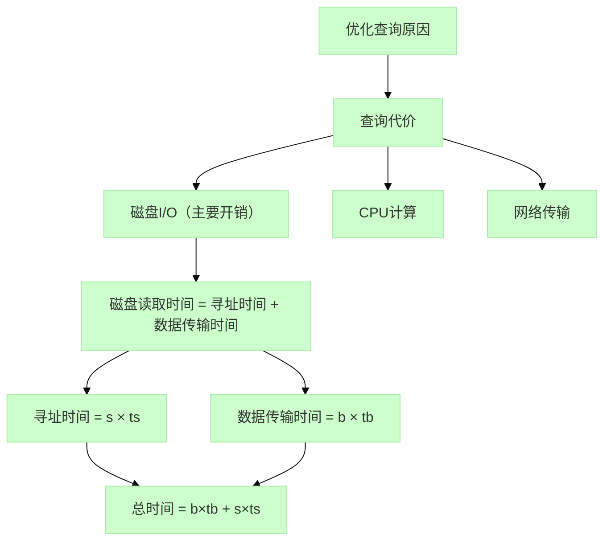

<center>

# 数据库

</center>

**姓名**: 李盛鹏 &nbsp;&nbsp;&nbsp;&nbsp;&nbsp;&nbsp;&nbsp;&nbsp;&nbsp;&nbsp;&nbsp;&nbsp;&nbsp;&nbsp;&nbsp;&nbsp;&nbsp;**学号**: 2351136 

---

## 2025.4.20
1. 学习了无损连接分解，主要有两种方法求解，一种是基于函数依赖交并，另一种是矩阵画图法
2. 学习了函数依赖的闭包，也就是一个属性所能决定的特征的有哪些
3. 知道了候选码是不能重复的，满足最小的原则
4. 学习了超键，还不是很懂和主码的关系，反正能唯一地确定元组
5. 阿姆斯特朗公理，其实就是最小依赖，通过你的function依赖，把冗余的依赖去掉
6. 学习了3NF范式，方法是：
   - 保函依赖分解题，先求最小依赖集。
   - 依赖两侧未出现，分成子集放一边
   - 若要连接成无损，再添候选做子集。


## 2025.4.25
1. 学习了B树和B+树的查找，构建，删除

---
<details>
<summary><b>数据库索引</b></summary>
   
### 数据库索引的作用  
索引文件较小，能快速访问数据，提高查询效率。

### 索引文件的结构   
如下图所示

| 第一部分        | 第二部分           |  
|---------------|--------------------|  
| **关键字**    | **指向数据记录的指针**           |  


### 数据库索引分类思维导图

以下是数据库索引的分类和关系整理：

#### 1. 按数据结构分类
```
├── 顺序索引 (Ordered Index)
│   ├── 稠密索引 (Dense Index) - 每个记录都有索引项
│   ├── 稀疏索引 (Sparse Index) - 仅部分记录有索引项，要求顺序索引，两个索引代表了一个区间
│   └── 多级索引 (Multilevel Index) - 索引的索引，指针的指针，往往是索引太大了装不下，才会考虑这个。分为外索引和内索引，外索引在左边，内索引在中间，数据在右边。外索引一定是稀疏索引，内索引可以是稠密索引或稀疏索引。不能都是稠密索引，不然没有区别没有意义。
└── 散列索引 (Hash Index) - 基于哈希函数直接定位
```

#### 2. 按物理存储分类
```
├── 聚集索引 (Clustered Index)
│   └── 就是表数据和索引在一个文件里，树的叶节点就是数据，表中的顺序和关键字的索引的顺序相同，例如学号相近的就聚集在一块，所以就是聚集索引
└── 非聚集索引 (Non-clustered Index)
    └── 就是表数据和索引不在一个文件里，树的叶节点就是指针，索引顺序与数据物理存储顺序无关
```

#### 3. 按功能特性分类
```
├── 主索引 (Primary Index) - 主键上的索引
├── 唯一索引 (Unique Index) - 确保列值唯一
├── 复合索引 (Composite Index) - 多列组合索引
└── 覆盖索引 (Covering Index) - 包含查询所需全部字段
```

### 索引的好坏
索引的好处：
- 加快数据的检索速度，减少磁盘 IO 操作，提高查询效率。
- 索引可以帮助数据库管理系统快速定位数据记录。

索引的坏处：  
- 索引占用磁盘空间，索引越多，占用的磁盘空间越大。
- 索引会降低数据的更新速度，插入删除操作时，索引也要更新。

### 索引建立的好坏判断标准
- 数据查询类型：等值或者范围查询。好不好查
- 用索引找到数据的时间
- 找到插入点的时间+更新索引结构的时间

### 插入索引
1. 稠密索引很容易插入，只需要更新索引文件即可。
2. 稀疏索引插入比较复杂，每个指针指向一个8KB的磁盘块，如果插入数据，要是超过了8KB，就要多一个溢出块，等后面再更新维护。

### B+树索引
1. 最多有几个子节点，就是几阶树
2. 叶子节点存放数据，中间节点存放索引


| 节点类型       | 子节点数范围/含有值的多少（最少）              | 子节点数范围/含有值的多少（最多）              |
|---------------|-------------------------|-------------------------|
| 中间节点       | ⌈n/2⌉ 个指针        |n 个指针        |
| 叶子节点       | ⌈(n-1)/2⌉ 个键值 |(n-1) 个键值        |
| 根节点         | 2  个指针（特殊）     |n 个指针        |
  
3. 假如说B+树只有两层，那就至少有2*⌈n/2⌉个搜索码，有三层，就至少有2*⌈n/2⌉*⌈n/2⌉个搜索码，有i层，就至少有2*⌈n/2⌉^i-1个搜索码。那么，我们查找某个搜索码，最少需要访问的节点数为
$$
\log_{\frac{n}{2}} \left( k \right)
$$
其中，k为搜索码的总数，n为阶数。

4. B+树在插入和删除的时候，只需要保证各个结点不低于⌈(n-1)/2⌉即可，如何去合并兄弟节点因人而异，合理即可。

### 静态散列
- 静态散列由两部分组成：bucket和散列函数H。
- 对于搜索码k，H(k) = bucket的地址，不同的k可以是得到相同的地址，bucket往往是一个磁盘块，能装许多单元。

#### 哈希函数的好坏
- 好：每个bucket中分配的搜索码的数量相同
- 坏：每个搜索码都在一个bucket中

#### 溢出处理
用溢出链，即bucket后接一块bucket

### 动态散列
- 不同的是，它能动态处理bucket的大小，还有哈希函数的取值
  
动态散列的步骤：先将搜索码根据某一个函数，编写成32为的二进制数列，然后依据前缀码的不同划分bucket。

### 多码访问
就是where语句中多个条件

### 位图索引
举一个具体的例子：员工表的状态查询
假设我们有一个简单的员工表 `employees`，包含以下数据：

| emp_id | name   | gender | dept    | status     |
|--------|--------|--------|---------|------------|
| 1      | 张三   | 男     | 销售    | 在职       |
| 2      | 李四   | 女     | 技术    | 离职       |
| 3      | 王五   | 男     | 销售    | 在职       |
| 4      | 赵六   | 女     | 人事    | 休假       |
| 5      | 钱七   | 男     | 技术    | 在职       |


#### 1. 为 `status` 列创建位图索引

`status` 列有3个不同的值："在职"、"离职"、"休假"，我们为每个值创建一个位图：

```
在职: 1 0 1 0 1  (第1、3、5条记录是在职状态)
离职: 0 1 0 0 0  (只有第2条记录是离职状态)
休假: 0 0 0 1 0  (只有第4条记录是休假状态)
```

#### 2. 为 `gender` 列创建位图索引

`gender` 列有2个不同的值："男"、"女"：

```
男: 1 0 1 0 1  (第1、3、5条记录是男性)
女: 0 1 0 1 0  (第2、4条记录是女性)
```

#### 3. 为 `dept` 列创建位图索引

`dept` 列有3个不同的值："销售"、"技术"、"人事"：

```
销售: 1 0 1 0 0
技术: 0 1 0 0 1
人事: 0 0 0 1 0
```

##### 查询示例

#### 查询1：查找所有在职的男性员工

```
在职: 1 0 1 0 1
男:   1 0 1 0 1
AND操作:
     1&1=1, 0&0=0, 1&1=1, 0&0=0, 1&1=1
结果: 1 0 1 0 1 → 第1、3、5条记录
```

#### 位图索引的优势

1. **快速多条件查询**：通过简单的位运算(AND/OR/NOT)就能组合多个条件
2. **空间效率**：对于低基数列，位图比传统索引更节省空间
3. **统计方便**：计算1的个数就能知道匹配的记录数

</details>

<details>
<summary><b>查询处理和查询优化</b></summary>  

# 查询处理
## 数据库查询流程图
前端query -> 解析命令 -> 形成关系代数表达式 -> 优化(基于统计信息的输入) -> 决策一个较优的过程 -> 执行引擎 -> 输出结果

## 查询优化

## 数据查询的算法
### 全表扫描算法
- 假设内存共有M块
- 1. 读取M块到内存
- 2. 检查每个元组t，满足条件则输出
- 3. 如果还有未处理的块，则重复1和2
#### 结论1：全表扫描一定要读全部内容到内存内，很浪费空间
#### 结论2：若r表(作外表)大小为a个数据块，s表(做内表)大小为b个数据块，每个数据块装n条数据，则全表扫描需要加载
$$
\underbrace{a}_{\text{外表初始加载}} + 
\underbrace{a \times n \times b}_{\substack{
\text{每条外表记录} \\ 
\text{都需要加载内表}
}}
$$

  
特殊情况： 如果只有一个匹配项
- 那么平均的读取的长度为一半的磁盘内容

### 索引扫描算法
- 在硬盘内进行，通过索引找到指针
- 把该指针的内容读入内存
#### 结论：索引扫描肯定比全表扫描效率高

例子：where Sage > 20
- 1. 用B+树找到Sage = 20 的索引项，然后再顺序集上寻Sage > 20 的指针
- 2. 将这部分指针的内容读入内存

## 连接操作
### 嵌套连接（两个for循环）
- 外层循环遍历一个表的每一行，内层循环遍历另一个表，比较两表的连接条件。
- 适用于小表与大表的连接，或者连接条件选择性极高的情况，否则效率较低。
### 排序合并算法
- 按照连接字段，将两个表排序
- 然后使用两个指针分别指向两个表的起始位置，依次比较连接字段的值。
- 如果值相等，则输出连接结果；如果不等，则移动较小的那个值的指针。
- 最后代价是，两个表都要过一遍，一共过两遍
- 适用于两个表都比较大且连接字段上有索引的情况，可以减少排序带来的开销。
### 索引连接
- 如果其中的一个表在连接字段上有索引，那么可以利用该索引来加速连接操作。
- 通过遍历有索引的表，使用索引查找另一个表中满足连接条件的记录。
- 适用于一个表较大，另一个表较小的情况，或者连接字段上有索引的情况。
### hash 连接
- 两个表都按照连接字段hash到桶中
- 根据同一个桶内连接字段按要求匹配连接

### 外排序-归并
假设内存一共可以存放M块数据块，其中一块用于缓存记录，来更新硬盘数据，另外M-1块用于归并排序。
- 假设硬盘有N个桶，每个桶中有M个数据块，是内存帮忙排序好的。
- 1. 假如N < M, 则一趟归并排序即可将这N个桶排序好输入到硬盘中。
- 2. 假如N >= M, 则需要多趟归并排序。每一趟不代表只进行一次排序，而是说一轮排序，假如说100个桶和11个内存块，那么第一趟就得到10个排好的桶，每个桶的存储空间是原先桶的十倍，再排一次就排好了。
- 结论，一般来说，内存很小，是多趟归并排序，趟数为 $\lceil \log_{m-1}(N) \rceil$

</details>
