<center>

# 数据库

</center>

**姓名**: 李盛鹏 &nbsp;&nbsp;&nbsp;&nbsp;&nbsp;&nbsp;&nbsp;&nbsp;&nbsp;&nbsp;&nbsp;&nbsp;&nbsp;&nbsp;&nbsp;&nbsp;&nbsp;**学号**: 2351136 

---

## 2025.4.20
1. 学习了无损连接分解，主要有两种方法求解，一种是基于函数依赖交并，另一种是矩阵画图法
2. 学习了函数依赖的闭包，也就是一个属性所能决定的特征的有哪些
3. 知道了候选码是不能重复的，满足最小的原则
4. 学习了超键，还不是很懂和主码的关系，反正能唯一地确定元组
5. 阿姆斯特朗公理，其实就是最小依赖，通过你的function依赖，把冗余的依赖去掉
6. 学习了3NF范式，方法是：
   - 保函依赖分解题，先求最小依赖集。
   - 依赖两侧未出现，分成子集放一边
   - 若要连接成无损，再添候选做子集。


## 2025.4.25
1. 学习了B树和B+树的查找，构建，删除

---

<details>
<summary><b>数据库系统概述</b></summary>  

## 1. 数据库系统
### 1.1 数据库的定义
- **抽象理解**：一组相互关联的、有组织的、可管理和可共享的数据集合。
- **具体理解**：数据库就是存储数据以及数据之间的联系的东西

### 1.2 数据库系统的基本特征
- 数据按一定的数据模型组织、描述和储存
- 支持数据的增、删、改、查
- 支持并发查询处理

### 1.3 数据库管理数据的层次
数据库系统采用三层抽象架构来管理数据。分别是：
- 物理层：负责把数据放在存储单元上。
- 逻辑层：负责描述数据库中存储什么数据以及数据间的关系
- 视图层：提供数据的逻辑视图，即数据的逻辑结构和关系的表示。


#### **1.3.1 数据库视图**
视图是基于一个或多个数据库表的 **查询结果** 构成的 **虚拟表** 。其特点为：
- 不存储实际数据，只存储查询逻辑（SQL语句）。
- 数据来源于基表（真实表），基表数据变化时，视图数据自动更新。
- 可以像普通表一样查询，但通常不能直接修改（除非满足特定条件）。

数据库视图就是一个黑箱，创建时已经往里面写好了Sql语句，只要调用就可以看到结果。这能保证数据的安全，也可作为等级的权限。

### 1.4 数据库的三级模式结构
上一节提到了三层，相应的，数据库通过三级模式来分别对应三层的实现。
- 外模式/子模式(External schema): 负责实现视图层，是定义特定应用程序看到的数据结构
- 概念模式/逻辑模式/模式(Logical schema): 对应于逻辑层，描述整个数据库的逻辑结构
- 物理模式/内模式/存储模式(Physical schema): 对应于物理层，描述数据的物理存储细节

### 1.5 数据库的二级映像
- **外模式/模式映像**
- **模式/内模式映像**

## 2. 数据
### 2.1 数据的独立性
上层应用程序与底层存储是相互独立的
- 物理数据独立性：数据库管理员可以优化硬盘上的存储方式（如换索引、换存储引擎、调整数据压缩等），但应用程序看到的表结构完全不变，代码无需调整。
- 逻辑数据独立性：即使数据库表结构变了（如新增字段、拆表），通过视图或映射机制，应用程序仍然看到原来的结构  

就是最底下两层结构，和最上层结构相独立。

### 2.2 数据模型
#### 2.2.1 数据模型的组成要素
- 数据结构（Data Structure）
- 数据操作（Data Operations）
- 完整性约束（Integrity Constraints）

## 3. SQL语言
SQL同时包含两种类型的命令：
- 数据定义语言（Data-definition language, DDL）
- 数据操纵语言（Data-manipulation language, DML）


</details>

<details>
<summary><b>关系模型</b></summary>

## 1、关系模型基本概念
1. **关系(Relation)**：二维表格，由行和列组成
2. **属性(Attribute)**：表中的一列，也称为字段
3. **关系模式**：关系的结构，由关系名、属性名组成
4. **元组(Tuple)**：表中的一行，也称为记录
5. **基数(Cardinality)**：关系中元组的数量
6. **度数(Degree)**：关系中属性的数量
### 1.1 关系
**概念：** 给定集合 𝐷1,𝐷2, ⋯ ,𝐷𝑛，关系 𝑟 是 𝐷1 × 𝐷2 × ⋯ × 𝐷𝑛 的子集 **(其实就是表格)**

举个例子：
| 集合 | 元素 |
| --- | --- |
|customer_name| Jones, Smith, Curry, Lindsay|
|customer_street| Main, North, Park|
|customer_city| Harrison, Rye, Pittsfield|

则这三个集合进行笛卡尔积，变成一个各种搭配的表格，取其子表，取其中唯一符合条件的搭配，就是关系，就是表格。

### 1.2 属性
每个表格的列名就是属性，比如上面的例子，customer_name, customer_street, customer_city 就是三个属性。

- 属性的域(Domain)：该属性所有可用且合法的取值集合
- 属性的值：通常要求是原子的(atomic)，不能是多值属性或复合属性。也可能是空值(Null value)， 表示值未知或不存在

### 1.3 关系模式
𝑅 = (𝐴1, 𝐴2, … , 𝐴𝑛) R就是 **关系模式**  
r(R) 表示关系模式R上的一个 **关系**

## 2. 码
1. **超码(Superkey)** ：能唯一标识元组的属性集合，可包含多余属性
2. **候选码(Candidate key)** ：能唯一标识元组的 **最小** 属性集合，最小属性可以是复合属性，比如(Sno, Cno)
3. **主码(Primary key)** ：从候选码中选出的一个，不能为空(NULL)，值唯一
4. **外码(Foreign key)** ：一个关系中的属性集，引用另一个关系的主码, 保证参照完整性
5. **搜索码**：搜索码指的是sql语句中的 where name = "Amy" 中的name
### 2.1 码间关系
对于一个关系： $学生(学号, 身份证号, 姓名, 性别, 院系)$

- **超码**：
  - {学号}
  - {身份证号}
  - {学号, 姓名}
  - {身份证号, 性别}
  - {学号, 身份证号, 姓名}
  
  这些都是超码，因为它们都能唯一标识一个学生

- **候选码**：
  - {学号}
  - {身份证号}
  
  这些是最小的超键，没有多余的属性，这叫候选码

- **主码**：
  - 选择{学号}作为主码，即从候选码中随便挑一个

只有这三个可以确定一个关系中的所有属性。


## 3. 关系代数
关系代数中有 **基本操作** 和 **附加操作**   

$六个基本操作（红色：一元运算，其他：二元运算）$
- **Select (选择)**     一元运算
- **Project (投影)**    一元运算
- **Union (集合并)**    二元运算
- **Set difference (集合差)**   二元运算
- **Cartesian product (笛卡尔积)**    二元运算
- **Rename (重命名)**   一元运算


$五个附加操作$
- **Set intersection (集合交)**
- **Natural join (自然连接)**
- **Outer join（外连接）**
- **Division (除)**
- **Assignment (赋值)**
### 3.1 Select (选择)
$$𝜎_𝑃(𝑟) = \{𝑡 | 𝑡 ∈ 𝑟 \ 𝑎𝑛𝑑 \ 𝑃(𝑡) \}$$
𝑃 是由 ∧（与）、∨（或）、¬（非）、=、≠、<、>、≤、≥ 组成的选择谓词。  

.png)
### 3.2 Project (投影)
$$Π_{𝐴_1,𝐴_2,\dots,𝐴_𝑘}(𝑟)$$

.png)

### 3.3 Union (集合并)
$$𝑆_1 ∪ 𝑆_2 = \{𝑡 | 𝑡 ∈ 𝑆_1 ∨ 𝑡 ∈ 𝑆_2\}$$
$𝑆_1$ 和 $𝑆_2$ 必须同元，特征相同   
.png)
### 3.4 Set difference (集合差)
$$𝑆_1 - 𝑆_2 = \{𝑡 | 𝑡 ∈ 𝑆_1 \ and \ t ∉  𝑆_2\}$$


.png)

### 3.5 Cartesian product (笛卡尔积)
$$𝑆_1 × 𝑆_2 = \{𝑡_1 𝑡_2 | 𝑡_1 ∈ 𝑆_1 \ and \ 𝑡_2 ∈ 𝑆_2\}$$
也可以称作 **乘积**，要求 $𝑆_1 ∩ 𝑆_2 = ∅$ ,否则需要将特征重命名，比如说 $𝑆_1.ID$ 与 $𝑆_2.ID$ 

.png)
### 3.6 Rename (重命名)
$$\rho_{X(A_1, A_2, \dots, A_n)}(E)$$

将关系 $E$ 的重命名为 $X$ ，并将其属性依次重命名为 $A_1, A_2, \dots, A_n$

### 3.7 Set intersection (集合交)
$$𝑆_1 ∩ 𝑆_2 = \{𝑡 | 𝑡 ∈ 𝑆_1 \ and \ 𝑡 ∈ 𝑆_2\}$$

.png)

### 3.8 Natural join (自然连接)
𝑅 = (𝐴, 𝐵, 𝐶, 𝐷), 𝑆 = (𝐵,𝐷, 𝐸)
- 结果模式: (𝐴,𝐵, 𝐶,𝐷, 𝐸)
- 𝑟 ⋈ 𝑠 就相当于 $Π_{𝑟.𝐴, 𝑟.𝐵, 𝑟.𝐶, 𝑟.𝐷, 𝑠.𝐸}(𝜎_{𝑟.𝐵 = 𝑠.𝐵 ⋀ 𝑟.𝐷=𝑠.𝐷}(𝑟 × 𝑠))$


.png)
### 3.9 外连接（Outer join）
#### **(1) 左外连接（Left Outer Join, ⟕）**
- **作用**：保留左表的所有元组，右表不匹配的填充 `NULL`。
- **符号**： $R \ ⟕ \ S$ 
#### **(2) 右外连接（Right Outer Join, ⟖）**
- **作用**：保留右表的所有元组，左表不匹配的填充 `NULL`。
- **符号**： $R \ ⟖ \ S$
#### **(3) 全外连接（Full Outer Join, ⟗）**
- **作用**：保留两表的所有元组，不匹配的部分填充 `NULL`。
- **符号**： $R \ ⟗ \ S$


### 3.10 Division (除)
$$𝑆_1 ÷ 𝑆_2 = \{𝑡 | 𝑡 ∈ Π_{𝑅−𝑆} (r)  \ and \ ∀𝑢 ∈ 𝑠(𝑡𝑢 ∈ 𝑟) \}$$
- 𝑅 = (𝐴1, … , 𝐴𝑚,𝐵1, … ,𝐵𝑛)
- 𝑆 = (𝐵1, … , 𝐵𝑛)

R ÷ S表示的就是R上具有S所有属性的元组

.png)

### 3.11 Assignment (赋值)
赋值就是 **←**  

write 𝑟 ÷ 𝑠 as:
- 𝑡𝑒𝑚𝑝1 ← Π𝑅−𝑆(𝑟)
- 𝑡𝑒𝑚𝑝2 ← Π𝑅−𝑆( 𝑡𝑒𝑚𝑝1 × 𝑠 − Π𝑅−𝑆,𝑆 𝑟 )
- 𝑟𝑒𝑠𝑢𝑙𝑡 = 𝑡𝑒𝑚𝑝1 − 𝑡𝑒𝑚𝑝2

### 3.12 聚合函数
- avg: average value
- min: minimum value
- max: maximum value
- sum: sum of values
- count: number of values


</details>

<details>
<summary><b>E-R 图和关系模式</b></summary>

## 1. E-R图
由三部分组成：实体、属性、关系。
- **实体集(Entity)**：现实世界中可区别的客观事物
- **属性(Attribute)**：实体或关系的特征
- **联系集(Relationship)**：实体之间的联系
### 1.1 实体集
实体具有属性，像人的年龄。  
实体集表示具有相同属性的实体的集合，如人的集合
### 1.2 属性
和上面的概念吻合，实体包含一组属性，这些属性为实体集的所有成员所共有。教师：ID、姓名、薪资
### 1.3 联系集
两个实体之间的因为某种属性联系起来，就像“学生”之间的导师联系集可能包含“日期”属性，用于记录学生开始与导师建立关联的时间

### 1.4 约束
约束分为两种：
- **映射基数**
- **参与约束**
#### 1.4.1 映射基数
映射基数，A和B是两个实体集，映射基数就是一个实体可以关联的实体数量。要么一对一，要么多对一...  
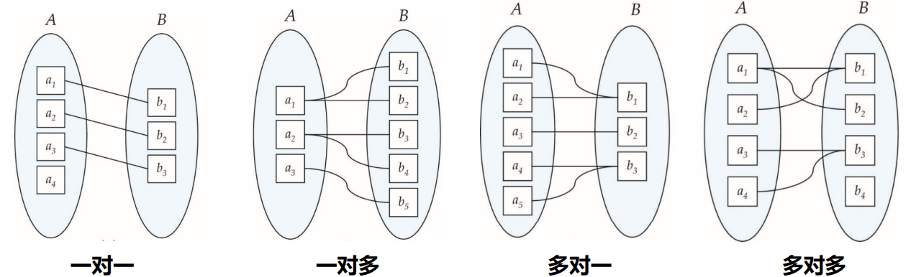
#### 1.4.2 参与约束(Participation Constraints)
要么全部参与，要么部分参与。比如有些导师会指导学生，有些不会。

### 1.5 E-R图绘制
有两种绘制方法，一种是实体集和属性画一起，一种是分开画。  
1. **矩形表示实体集** 
2. **椭圆表示属性** 
3. **菱形表示关系集**
4. **双椭圆表示多值属性**
5. **虚线椭圆表示派生属性**
6. **下划线表示主键属性**


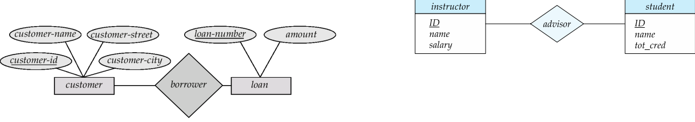
#### 1.5.1 映射基数的表示
用箭头，双箭头表示一对一，箭头指向一的一方。

</details>

<details>
<summary><b>关系数据库设计优化</b></summary>

## 1. 为什么需要进行优化
我们要考虑数据库的好坏，坏的数据库要优化。评判的标准是：  数据冗余  + 增删改查
### 举例
如 $Student = (Sno,Sdept,MName,Cno,Grade)$ 
- **增加异常**：由于主键不能为空，新来的学生没选课，没有Cno，因此无法插入，增加失败
- **删除异常**：某年毕业，全部学生删除，导致系主任名字被连同删，就不知道谁是系主任，删除异常。
- **修改异常**：某个系主任调离，由于Sdept和MName在表中重复出现，导致修改时工作量很大，修改异常。
 
## 2. 函数依赖
R是属性集，α，β是其子集。拿出表中两行，如果这两行α相同，则β相同。那么α→β就是函数依赖。

这个概念比候选码弱，因为这个码不一定能决定一个元组。 **如果α→R，则α就是超码。**

### 平凡函数依赖
这个就是废话，例如(Sno,Cno)→Sno,就是自己的属性推自己。
### 非平凡函数依赖
(Sno,Cno)→Grade，就是推出新的东西
### 完全函数依赖
对于 $SC(Sno,Cno,Grade)$ 
- (Sno,Cno)→Grade
- (Cno)推不出Grade
- (Sno)推不出Grade

那么这个(Sno,Cno)→Grade就是完全函数依赖。
### 部分函数依赖
就是α中有混子，比如(Sno,Cno,Grade)→Gender,其中Grade就是混子。只依赖前俩。
### 传递函数依赖
如果X→Y且Y推不出X，Y→Z，那么X→Z。这就是传递依赖

---

### 2.1 函数依赖闭包
**函数依赖闭包（F⁺）**：给定一个函数依赖集 **F**，其闭包 **F⁺** 是 **F** 逻辑蕴含的所有函数依赖的集合。


**Armstrong 公理**：用于推导 **F⁺** 的三个基本规则：
- **自反律（Reflexivity）**：若 **Y ⊆ X**，则 **X → Y**。
- **增广律（Augmentation）**：若 **X → Y**，则 **XZ → YZ**（**Z** 为任意属性集）。
- **传递律（Transitivity）**：若 **X → Y** 且 **Y → Z**，则 **X → Z**。

此外，Armstrong 公理还可推导出以下规则：
- **合并规则**：若 **X → Y** 且 **X → Z**，则 **X → YZ**。
- **分解规则**：若 **X → YZ**，则 **X → Y** 且 **X → Z**。
- **伪传递规则**：若 **X → Y** 且 **WY → Z**，则 **WX → Z**。

---

#### **计算函数依赖闭包（F⁺）**
**F⁺** 包含所有能从 **F** 推导出的函数依赖，计算步骤是不断凭借初始的F根据Armstrong公理推导新的依赖，直到不再变化。

**示例**：
- **F = {A→B, B→C}**
- **F⁺** 包括：
  - **A→B**, **B→C**（原始）
  - **A→A**, **B→B**, **C→C**（自反律）
  - **A→AB**, **B→BC**, **AB→AC**（增广律）
  - **A→C**（传递律）
  - **A→Φ** 这些也算
  - 以及所有能由这些规则推导出的依赖。

---

#### **计算属性闭包（X⁺）**
**属性闭包（X⁺）**：给定属性集 **X**，**X⁺** 是所有能由 **X** 通过 **F** 推导出的属性集合。

#### **计算步骤**
1. 初始化 **X⁺ = X**。
2. 遍历 **F** 中的每一个函数依赖 **A → B**：
   - 如果 **A ⊆ X⁺**，则 **X⁺ = X⁺ ∪ B**。
3. 重复步骤 2，直到 **X⁺** 不再变化。
4. 最终 **X⁺** 即为 **X** 的属性闭包。

**示例**：
- 关系 **R(A,B,C,D,E)**，函数依赖集 **F = {A→B, BC→D, D→E}**
- 计算 **{A,C}⁺**：
  1. **X⁺ = {A,C}**
  2. **A→B**：**A ⊆ X⁺**，所以 **X⁺ = {A,B,C}**
  3. **BC→D**：**BC ⊆ X⁺**，所以 **X⁺ = {A,B,C,D}**
  4. **D→E**：**D ⊆ X⁺**，所以 **X⁺ = {A,B,C,D,E}**
  5. 无法再扩展，最终 **{A,C}⁺ = {A,B,C,D,E}**

---

### 2.2 正则覆盖
在函数依赖闭包中，存在冗余的函数依赖
- **完全冗余FD**：可由其他FD推出的依赖  
  示例：`{A→B, B→C, A→C}` 中 `A→C` 冗余（由 `A→B` 和 `B→C` 传递推出）
- **部分冗余属性**：
  - **LHS冗余**：如 `{A→B, B→C, AC→D}` 可简化为 `{A→B, B→C, A→D}`（因为 `A→C` 可通过传递得到，`C` 在 `AC→D` 中冗余）
  - **RHS冗余**：如 `{A→B, B→C, A→CD}` 可简化为 `{A→B, B→C, A→D}`（因为 `A→C` 已可推出）

去除这些冗余最后得到的不可简化的依赖集就是正则覆盖。

### **计算步骤**
1. **分解右部**：将复合RHS拆分为单属性（如 `α→AB` → `α→A`, `α→B`）。
2. **消除无关属性**：
   - 检查LHS：删除冗余属性（如 `AB→C` 若 `A→C` 成立，则 `B` 冗余）。
   - 检查RHS：删除冗余属性（如 `α→AB` 若 `α→A` 已存在且 `α→B` 可推出，则 `A` 冗余）。
3. **迭代**：直至FD集不再变化。

### **示例**
- **输入**：`F = {A→BC, B→AC, C→AB}`  
- **步骤**：
  1. 分解右部：`{A→B, A→C, B→A, B→C, C→A, C→B}`  
  2. 消除冗余FD：发现所有FD均冗余（因 `A→B→C→A` 形成环），可简化为 `{A→B, B→C, C→A}`。  
  3. 检查无关属性：无。  
- **正则覆盖**：`Fₖ = {A→B, B→C, C→A}`（不唯一，也可选 `{A→C, C→B, B→A}`）。                

**注**：正则覆盖不唯一，但能保证逻辑等价性和最小性。

---

### 2.3 基于函数依赖的关系分解
- 原关系模式 𝑅 的所有属性必须出现在分解结果中（𝑅1, 𝑅2）  
    $𝑅 = 𝑅1 ∪ 𝑅2$
- 无损连接分解  
    $r = Π_{𝑅_1}(r) ⋈Π_{𝑅_2}(r)$  

### **判断方法**
$𝑅1 ∩ 𝑅2 → 𝑅1$ 或 $𝑅1 ∩ 𝑅2 → 𝑅2$

我的理解就是，一个表等着另一个表接上来，如果交集是来接的那个表的候选码，那就正好接上，否则冗余接冗余，不是无损连接分解。

### **矩阵法判断**

---

### 3. 范式
范式是关系数据库设计的规范化标准，用于减少数据冗余、避免数据异常（插入/更新/删除异常）。主要范式包括：
1. **1NF（第一范式）**
2. **2NF（第二范式）**
3. **3NF（第三范式）**
4. **BCNF（Boyce-Codd范式）**
5. **4NF（第四范式）**
6. **5NF（第五范式）**

范式的严格性逐级递增（1NF < 2NF < 3NF < BCNF < 4NF < 5NF）。

---

### **3.1 各范式详解**

### **1NF（第一范式）**
**定义**：  
- 所有属性都是**原子性**的（不可再分）。  
- 每一行有**唯一标识**（主键）。  

**示例**：  
❌ 非1NF（多值属性）：
| Student | Courses       |
| ------- | ------------- |
| Alice   | Math, Physics |

✅ 1NF：
| Student | Course  |
| ------- | ------- |
| Alice   | Math    |
| Alice   | Physics |

---

### **2NF（第二范式）**
**定义**：  
- 满足1NF。  
- **所有非主属性必须完全函数依赖于候选键**（消除部分依赖）。  
 

**示例**：  
❌ 非2NF（`Grade` 部分依赖 `(StudentID, CourseID)`，因为 `CourseName` 只依赖 `CourseID`）：
| StudentID | CourseID | CourseName | Grade |
| --------- | -------- | ---------- | ----- |
| 101       | C1       | Math       | A     |

✅ 2NF分解：  
**表1**（完全依赖）：
| StudentID | CourseID | Grade |
| --------- | -------- | ----- |
| 101       | C1       | A     |

**表2**（消除部分依赖）：
| CourseID | CourseName |
| -------- | ---------- |
| C1       | Math       |

---

### **3NF（第三范式）**
**定义**：  
- 满足2NF。  
- **非主属性不能传递依赖于候选键**（即不存在 `A → B → C`，其中 `A` 是候选键）。  


**示例**：  
❌ 非3NF（`Zip → City`，形成传递依赖 `StudentID → Zip → City`）：
| StudentID | Zip  | City    |
| --------- | ---- | ------- |
| 101       | 1001 | Beijing |

✅ 3NF分解：  
**表1**：
| StudentID | Zip  |
| --------- | ---- |
| 101       | 1001 |

**表2**：
| Zip  | City    |
| ---- | ------- |
| 1001 | Beijing |

---

### **BCNF（Boyce-Codd范式）**
**定义**：  
- 满足3NF。  
- **所有函数依赖的左部必须是超键**（即若 `X → Y`，则 `X` 必须是候选键）。  

 

**示例**：  
❌ 非BCNF（`Course → Teacher`，但 `Course` 不是候选键）：
| Student | Course | Teacher |
| ------- | ------ | ------- |
| Alice   | Math   | Wang    |

✅ BCNF分解：  
**表1**：
| Student | Course |
| ------- | ------ |
| Alice   | Math   |

**表2**：
| Course | Teacher |
| ------ | ------- |
| Math   | Wang    |

---

### **4NF（第四范式）**
**定义**：  
- 满足BCNF。  
- **消除多值依赖**（即若 `X →→ Y`，则 `X` 必须是超键）。  

**问题场景**：  
- 一个属性决定多个独立的多值属性。  

**示例**：  
❌ 非4NF（`Course →→ Teacher` 和 `Course →→ Book` 独立多值依赖）：
| Course | Teacher | Book     |
| ------ | ------- | -------- |
| Math   | Wang    | Calculus |
| Math   | Wang    | Algebra  |
| Math   | Li      | Calculus |

✅ 4NF分解：  
**表1**：
| Course | Teacher |
| ------ | ------- |
| Math   | Wang    |
| Math   | Li      |

**表2**：
| Course | Book     |
| ------ | -------- |
| Math   | Calculus |
| Math   | Algebra  |

---

### **5NF（第五范式）**
**定义**：  
- 满足4NF。  
- **消除连接依赖**（数据必须能无损分解为更小的表）。  

**问题场景**：  
- 数据需通过多个表连接才能完整表示。  

**示例**：  
❌ 非5NF（`(A,B,C)` 需通过 `(A,B)`、`(B,C)`、`(A,C)` 连接才能恢复）：
| A   | B   | C   |
| --- | --- | --- |
| 1   | X   | a   |
| 1   | Y   | b   |

✅ 5NF分解为三个二元关系。

---

#### **范式对比总结**
| **范式** | **要求**                     | **解决的问题**       |
| -------- | ---------------------------- | -------------------- |
| 1NF      | 原子性、无重复列             | 数据存储规范化       |
| 2NF      | 消除非主属性对主键的部分依赖 | 部分依赖冗余         |
| 3NF      | 消除非主属性的传递依赖       | 数据间接冗余         |
| BCNF     | 所有依赖的左部为超键         | 主键与非主键的异常   |
| 4NF      | 消除多值依赖                 | 多值数据冗余         |
| 5NF      | 消除连接依赖                 | 复杂关系的数据完整性 |


</details>

<details>
<summary><b>数据库索引</b></summary>
   
### 数据库索引的作用  
索引文件较小，能快速访问数据，提高查询效率。

### 索引文件的结构   
如下图所示

| 第一部分        | 第二部分           |  
|---------------|--------------------|  
| **关键字**    | **指向数据记录的指针**           |  


### 数据库索引分类思维导图

以下是数据库索引的分类和关系整理：

#### 1. 按数据结构分类
```
├── 顺序索引 (Ordered Index)
│   ├── 稠密索引 (Dense Index) - 每个记录都有索引项
│   ├── 稀疏索引 (Sparse Index) - 仅部分记录有索引项，要求顺序索引，两个索引代表了一个区间
│   └── 多级索引 (Multilevel Index) - 索引的索引，指针的指针，往往是索引太大了装不下，才会考虑这个。分为外索引和内索引，外索引在左边，内索引在中间，数据在右边。外索引一定是稀疏索引，内索引可以是稠密索引或稀疏索引。不能都是稠密索引，不然没有区别没有意义。
└── 散列索引 (Hash Index) - 基于哈希函数直接定位
```

#### 2. 按物理存储分类
```
├── 聚集索引 (Clustered Index)
│   └── 就是表数据和索引在一个文件里，树的叶节点就是数据，表中的顺序和关键字的索引的顺序相同，例如学号相近的就聚集在一块，所以就是聚集索引
└── 非聚集索引 (Non-clustered Index)
    └── 就是表数据和索引不在一个文件里，树的叶节点就是指针，索引顺序与数据物理存储顺序无关
```

#### 3. 按功能特性分类
```
├── 主索引 (Primary Index) - 主键上的索引
├── 唯一索引 (Unique Index) - 确保列值唯一
├── 复合索引 (Composite Index) - 多列组合索引
└── 覆盖索引 (Covering Index) - 包含查询所需全部字段
```

### 索引的好坏
索引的好处：
- 加快数据的检索速度，减少磁盘 IO 操作，提高查询效率。
- 索引可以帮助数据库管理系统快速定位数据记录。

索引的坏处：  
- 索引占用磁盘空间，索引越多，占用的磁盘空间越大。
- 索引会降低数据的更新速度，插入删除操作时，索引也要更新。

### 索引建立的好坏判断标准
- 数据查询类型：等值或者范围查询。好不好查
- 用索引找到数据的时间
- 找到插入点的时间+更新索引结构的时间

### 插入索引
1. 稠密索引很容易插入，只需要更新索引文件即可。
2. 稀疏索引插入比较复杂，每个指针指向一个8KB的磁盘块，如果插入数据，要是超过了8KB，就要多一个溢出块，等后面再更新维护。

### B+树索引
1. 最多有几个子节点，就是几阶树
2. 叶子节点存放数据，中间节点存放索引


| 节点类型       | 子节点数范围/含有值的多少（最少）              | 子节点数范围/含有值的多少（最多）              |
|---------------|-------------------------|-------------------------|
| 中间节点       | ⌈n/2⌉ 个指针        |n 个指针        |
| 叶子节点       | ⌈(n-1)/2⌉ 个键值 |(n-1) 个键值        |
| 根节点         | 2  个指针（特殊）     |n 个指针        |
  
3. 假如说B+树只有两层，那就至少有 $2 \times ⌈n/2⌉$ 个搜索码，有三层，就至少有 $2 \times ⌈n/2⌉ \times ⌈n/2⌉$ 个搜索码，有i层，就至少有 $2 \times ⌈n/2⌉^{i} -1$ 个搜索码。那么，我们查找某个搜索码，最少需要访问的节点数为
$$\log_{\frac{n}{2}} \left( k \right)$$
其中，k为搜索码的总数，n为阶数。

4. B+树在插入和删除的时候，只需要保证各个结点不低于⌈(n-1)/2⌉即可，如何去合并兄弟节点因人而异，合理即可。

### 静态散列
- 静态散列由两部分组成：bucket和散列函数H。
- 对于搜索码k，H(k) = bucket的地址，不同的k可以是得到相同的地址，bucket往往是一个磁盘块，能装许多单元。

#### 哈希函数的好坏
- 好：每个bucket中分配的搜索码的数量相同
- 坏：每个搜索码都在一个bucket中

#### 溢出处理
用溢出链，即bucket后接一块bucket

### 动态散列
- 不同的是，它能动态处理bucket的大小，还有哈希函数的取值
  
动态散列的步骤：先将搜索码根据某一个函数，编写成32为的二进制数列，然后依据前缀码的不同划分bucket。

### 多码访问
就是where语句中多个条件

### 位图索引
举一个具体的例子：员工表的状态查询
假设我们有一个简单的员工表 `employees`，包含以下数据：

| emp_id | name   | gender | dept    | status     |
|--------|--------|--------|---------|------------|
| 1      | 张三   | 男     | 销售    | 在职       |
| 2      | 李四   | 女     | 技术    | 离职       |
| 3      | 王五   | 男     | 销售    | 在职       |
| 4      | 赵六   | 女     | 人事    | 休假       |
| 5      | 钱七   | 男     | 技术    | 在职       |


#### 1. 为 `status` 列创建位图索引

`status` 列有3个不同的值："在职"、"离职"、"休假"，我们为每个值创建一个位图：

```
在职: 1 0 1 0 1  (第1、3、5条记录是在职状态)
离职: 0 1 0 0 0  (只有第2条记录是离职状态)
休假: 0 0 0 1 0  (只有第4条记录是休假状态)
```

#### 2. 为 `gender` 列创建位图索引

`gender` 列有2个不同的值："男"、"女"：

```
男: 1 0 1 0 1  (第1、3、5条记录是男性)
女: 0 1 0 1 0  (第2、4条记录是女性)
```

#### 3. 为 `dept` 列创建位图索引

`dept` 列有3个不同的值："销售"、"技术"、"人事"：

```
销售: 1 0 1 0 0
技术: 0 1 0 0 1
人事: 0 0 0 1 0
```

##### 查询示例

#### 查询1：查找所有在职的男性员工

```
在职: 1 0 1 0 1
男:   1 0 1 0 1
AND操作:
     1&1=1, 0&0=0, 1&1=1, 0&0=0, 1&1=1
结果: 1 0 1 0 1 → 第1、3、5条记录
```

#### 位图索引的优势

1. **快速多条件查询**：通过简单的位运算(AND/OR/NOT)就能组合多个条件
2. **空间效率**：对于低基数列，位图比传统索引更节省空间
3. **统计方便**：计算1的个数就能知道匹配的记录数

</details>

<details>
<summary><b>查询处理和查询优化</b></summary>  

# 查询处理
## 数据库查询流程图
前端query -> 解析命令 -> 形成关系代数表达式 -> 优化(基于统计信息的输入) -> 决策一个较优的过程 -> 执行引擎 -> 输出结果

## 查询优化
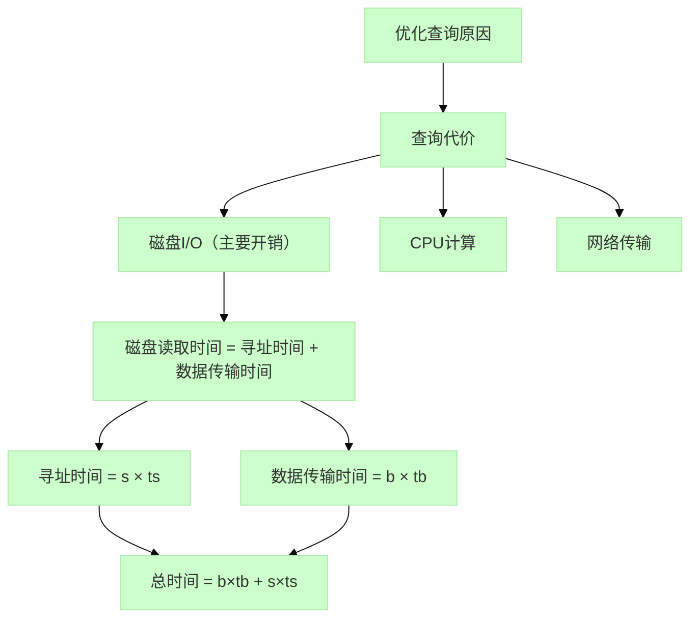
## 数据查询的算法
### 全表扫描算法
- 假设内存共有M块
- 1. 读取M块到内存
- 2. 检查每个元组t，满足条件则输出
- 3. 如果还有未处理的块，则重复1和2
#### 结论1：全表扫描一定要读全部内容到内存内，很浪费空间
#### 结论2：若r表(作外表)大小为a个数据块，s表(做内表)大小为b个数据块，每个数据块装n条数据，则全表扫描需要加载 $a + a \times n \times b$，其中 $a$ 表示外表初始加载， $a \times n \times b$ 表示每条外表记录需要加载内表。         这么多个数据块

  
特殊情况： 如果只有一个匹配项
- 那么平均的读取的长度为一半的磁盘内容

### 索引扫描算法
- 在硬盘内进行，通过索引找到指针
- 把该指针的内容读入内存
#### 结论：索引扫描肯定比全表扫描效率高

例子：where Sage > 20
- 1. 用B+树找到Sage = 20 的索引项，然后再顺序集上寻Sage > 20 的指针
- 2. 将这部分指针的内容读入内存

## 连接操作
### 嵌套连接（两个for循环）
- 外层循环遍历一个表的每一行，内层循环遍历另一个表，比较两表的连接条件。
- 适用于小表与大表的连接，或者连接条件选择性极高的情况，否则效率较低。
### 排序合并算法
- 按照连接字段，将两个表排序
- 然后使用两个指针分别指向两个表的起始位置，依次比较连接字段的值。
- 如果值相等，则输出连接结果；如果不等，则移动较小的那个值的指针。
- 最后代价是，两个表都要过一遍，一共过两遍
- 适用于两个表都比较大且连接字段上有索引的情况，可以减少排序带来的开销。
### 索引连接
- 如果其中的一个表在连接字段上有索引，那么可以利用该索引来加速连接操作。
- 通过遍历有索引的表，使用索引查找另一个表中满足连接条件的记录。
- 适用于一个表较大，另一个表较小的情况，或者连接字段上有索引的情况。
### hash 连接
- 两个表都按照连接字段hash到桶中
- 根据同一个桶内连接字段按要求匹配连接

### 外排序-归并
假设内存一共可以存放M块数据块，其中一块用于缓存记录，来更新硬盘数据，另外M-1块用于归并排序。
- 假设硬盘有N个桶，每个桶中有M个数据块，是内存帮忙排序好的。
- 1. 假如N < M, 则一趟归并排序即可将这N个桶排序好输入到硬盘中。
- 2. 假如N >= M, 则需要多趟归并排序。每一趟不代表只进行一次排序，而是说一轮排序，假如说100个桶和11个内存块，那么第一趟就得到10个排好的桶，每个桶的存储空间是原先桶的十倍，再排一次就排好了。
- 结论，一般来说，内存很小，是多趟归并排序，趟数为 $\lceil \log_{m-1}(N) \rceil$

</details>


<details>
<summary><b>事务</b></summary>  

## 事务的ACID特性
事务的ACID特性是数据库事务正确执行的四个基本要素的缩写，包括：

### 1. 原子性（Atomicity） ⚛️
- **定义**：事务是不可分割的工作单元，事务中的操作要么**全部成功**，要么**全部失败回滚**
- **示例**：银行转账包含扣款和收款两个操作，必须同时成功或同时失败

### 2. 一致性（Consistency） ✅
- **定义**：事务执行前后，数据库从一个**合法状态**迁移到另一个**合法状态**
- **要点**：
  - 满足预定义的完整性约束（主键、外键等）
  - 业务逻辑的一致性（如转账前后总金额不变）
- **示例**：A账户-100，B账户必须+100，总额保持不变

### 3. 隔离性（Isolation） 🚧
- **定义**：并发事务之间相互隔离，防止数据不一致
- **隔离级别**（从低到高）：
  1. 读未提交（Read Uncommitted）
  2. 读已提交（Read Committed）
  3. 可重复读（Repeatable Read）
  4. 串行化（Serializable）
- **并发问题**：
  - 脏读 ➜ 幻读 ➜ 不可重复读

### 4. 持久性（Durability） 💾
- **定义**：事务提交后，修改**永久保存**，即使系统故障也不丢失
  - Redo Log（重做日志）记录修改后的数据

#### 确保了数据库事务的可靠性和数据完整性

## 调度（Schedule）
### 串行调度
指的就是事情一件一件地办，办好上件事情再办下件事

### 冲突
不同事务A，B，同时操作一个数据库Q，至少有一个操作是**写操作**，便是冲突
## 冲突的四种情况分析
| 操作组合 | 是否冲突 | 说明 |
|----------|----------|------|
| read(Q) - read(Q) | ❌ 无冲突 | 纯读操作不改变数据状态 |
| read(Q) - write(Q) | ✅ 冲突 | 读后写可能导致脏读 |
| write(Q) - read(Q) | ✅ 冲突 | 写后读可能读到未提交数据 |
| write(Q) - write(Q) | ✅ 冲突 | 写写覆盖可能导致更新丢失 |


### 冲突可串行化
如果一个调度调整顺序，可以等价于一个串行调度，则称为冲突可串行化调度

#### 可安全交换的例子
T1: R(A)  T2: R(B)  -- 可任意交换  
T1: R(A)  T2: W(B)  -- 可交换（访问不同数据项）

### 可恢复性


### 可串行性检测
判断什么样的情况下是冲突可串行化的
#### 优先图(Precedence Graph)法：
```
# 构建步骤：
1. 为每个事务创建节点
2. 对每对冲突操作(Ti先于Tj执行)添加边 Ti→Tj,目前谁操作在前，就指向操作在后的。
3. 检查图中是否有环：
   - 无环 → 冲突可串行化
   - 有环 → 非冲突可串行化
```

如图所示：  
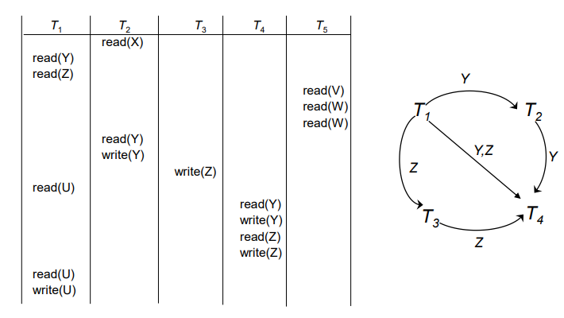  
显然是个无环图，因而可冲突串行化。
</details>


<details>
<summary><b>并发控制</b></summary>  

## 1. 并发控制
### 1.1 存在问题
#### 1.1.1 脏读
T1做了修改，T2读了修改，但是T1回滚了，导致T2读到脏数据。  
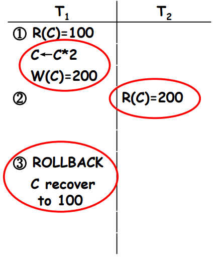 
#### 1.1.2 不可重复读
并发时，可能导致同一个事务内，多次读取同一数据却得到不同结果。  
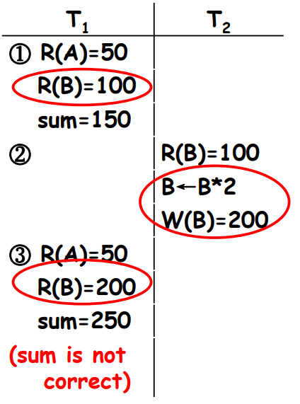 
#### 1.1.3 丢失修改
两个事务同时读一个数据块，并且都做出修改，最后的修改覆盖前一个修改，前一个修改未同步。  
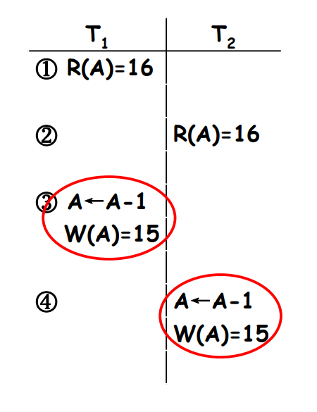 

## 2. 锁协议
### 2.1 定义：控制并发访问数据块，防止出现问题
### 2.2 锁的类型
- 排他锁/X
- 共享锁/S
### 2.3 锁的兼容性  
事务在操作数据块前，会得到一个锁，如果与别的并行操作的锁兼容，就可以动。不兼容，就wait。  
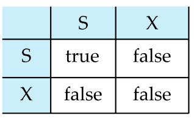
### 2.4 问题的解决
#### 2.4.1 丢失修改的解决
事务在修改数据前必须先获得排他锁，阻止其他事务同时修改  
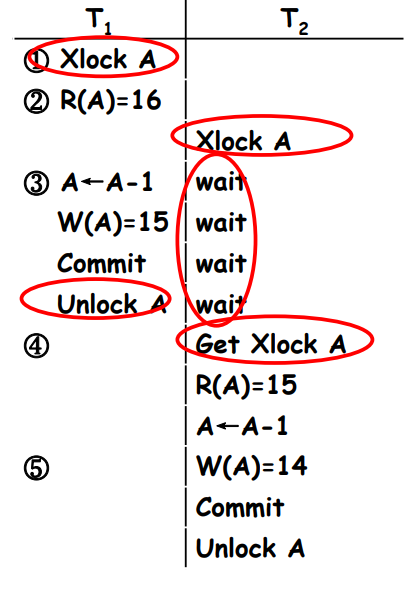   
可以看到，T2要修改时获取X锁不兼容，阻塞了进程，等T1释放锁后才能获取，才能进行
#### 2.4.2 不可重复读的解决
读取数据前先加共享锁，阻止其他事务获取排他锁  
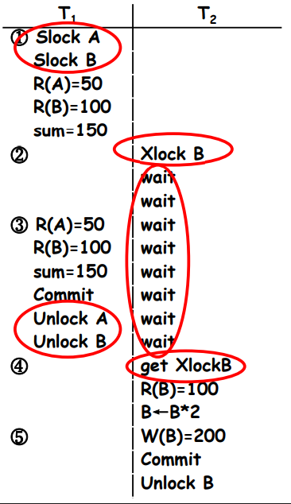  
#### 2.4.3 脏读的解决
由于是修改，因而加排他锁，阻止其他事务读取,那么回滚的时候，这个数据的修改会消失，但是别的事务却没有影响  
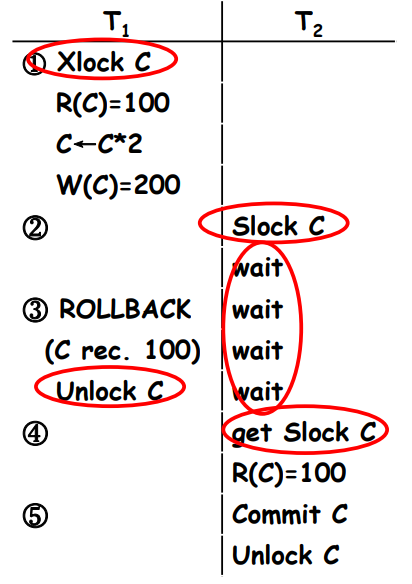 
### 2.5 两阶段锁协议（Two-Phase Locking, 2PL）
- 增长阶段  
    刚开始获取锁时，只能获取，不能释放
- 缩减阶段  
    结束时释放锁时，只能释放，不能获取 
### 2.6 死锁  
就是两个事务互相持有对方需要的锁，导致阻塞
### 2.7 饥饿  
由于锁分配不公平，导致事务很多资源无法获取

</details>
