<center>

# 计算机组成原理

</center>

**姓名**: 李盛鹏 &nbsp;&nbsp;&nbsp;&nbsp;&nbsp;&nbsp;&nbsp;&nbsp;&nbsp;&nbsp;&nbsp;&nbsp;&nbsp;&nbsp;&nbsp;&nbsp;&nbsp;**学号**: 2351136 

---
## 2025.4.20
1. 学习了寻址方式，一共有八种，区分在于有效地址(EA)是存在什么地方，EA表示指令中操作数所在存储单元的地址。
2. 辨别：机器会在OP给出具体的操作，还有寻址的方式。
- 立即数寻址：就是直接给你操作数
- 直接寻址：就是给你主存中操作数的地址EA
- 间接寻址：EA = [A]，DATA = [EA]，就是给你一个地址，取主存那可以得到EA
- 寄存器直接\间接寻址：其实就是把主存换成了寄存器
- 变址寻址：Ri给你一个变址寄存器的地址，可拿到一个偏移量。A给你主存的首地址。EA = A + Ri，根据偏移量可得EA。A可以是一个数组的首地址，Ri一偏移就可以完成数组操作。
```
+---------------+
|  OP | Ri | A  |
+---------------+
```
- 基址寻址：基址寻址和变址寻址反过来，Ri指向基址寄存器，里面存放了首地址，A提供了偏移量。EA = Ri + A。方便于用户信息操作。
- 相对编址：PC中存有正在进行的操作数，通过偏移量A，可以得到EA。PC = PC + A。
- 堆栈寻址：堆栈寻址就是把堆栈当作寄存器来用。SP给你堆栈的顶部地址，A给你偏移量。EA = SP + A。
### 不会的话可以看b站“一只乌龟大王”的寻址方式视频

3. 学习了浮点运算指令，兼容机要求指令系统相同。
4. 学习了RISC(ARM)精简指令，CISC(x86)复杂指令。
5. 讨论了MIPS指令系统，包括R类型、I类型、J类型。

## 2025.5.5
1. 温习了计算机硬件系统：运算器、控制器、存储器、输入设备、输出设备
2. 运算器包括算术运算和逻辑运算，加减乘除，移位
3. 5.控制器：由指令寄存器(IR)、程序计数器(PC)、指令译码器、时钟脉冲(CP)、时序信号发生器、微操作控制部件(产生微操作控制信号)六大部分组成
4. CISC：复杂指令系统计算机，强化指令功能  
RISC：精简指令系统计算机，降低指令系统复杂性
5. 三态电路：三态反向门
       - 三态电路由正常态转变为高阻态的过程总是快于高阻态向正常态的转变的 
6. 异或门
   - 原码转反码 
       - 当控制端为 1 时，输出为输入的反码；当控制端为 0 时，输出为输入的原码
   - 半加器
   - 本位就是一个异或门，进位是一个与门
   - 全加器
   - 本质上为两个半加器，本位是三个异或，进位是两两与门相或。如果要超前的话，P视为A+B，G视为A*B
   - 数码比较器
   - 奇偶检测器
   - 当有奇数个1时输出1，否则输出0


<details>
<summary><b>主存储器</b></summary>  

## 1. 存储器的分类
### **1.1 按存储介质分类**
- **半导体存储器**  
  - 特点：速度快、体积小、功耗低（如内存、闪存）。  
  - 例子：DRAM、SRAM、SSD（NAND Flash）。  
- **磁存储器**  
  - 特点：非易失性、容量大、速度较慢。  
  - 例子：硬盘（HDD）、磁带。  
- **光存储器**  
  - 特点：成本低、可移动、速度慢。  
  - 例子：CD、DVD、蓝光光盘。  

### **1.2 按存取方式分类**
- **随机存取存储器（RAM）**  
  - 任意地存取数据单元
  - 例子：DRAM（动态RAM）、SRAM（静态RAM）。  
- **只读存储器（ROM）**  
  - 只读不改，较稳定
  - 碟片，专辑  
- **顺序存取存储器（SAM）**  
  - 按顺序访问数据，速度慢。  
  - 例子：磁带。  
- **直接存取存储器（DAM）**  
  - 既有随机存取，也有顺序存取。像硬盘那个指针就是随机存取，转轴就是顺序存取  
  - 例子：硬盘、光盘。

### **1.3. 按信息易失性分类**
- **易失性存储器（Volatile）**  
  - 断电后数据丢失。  
  - 例子：主存，cache  
- **非易失性存储器（Non-Volatile）**  
  - 断电后数据保留。  
  - 例子：磁盘，光盘。  

### 存储器系统金字塔
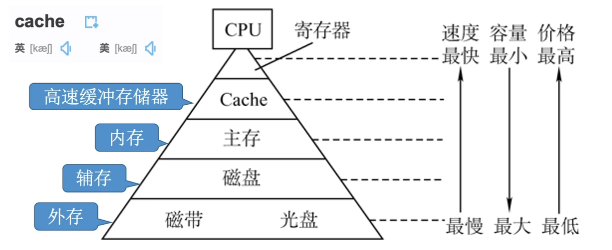

## 2. 存储器的性能指标
- 1. 存储容量（Capacity）： 存储单元个数 * 存储字长
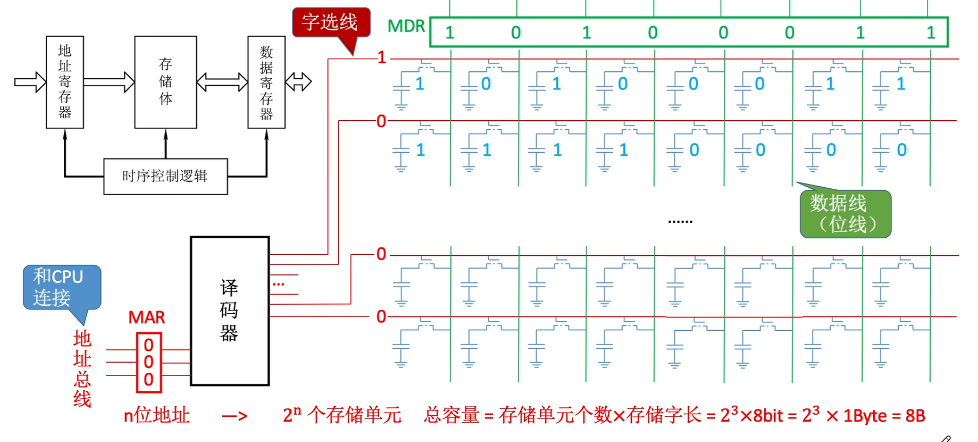  
你看这个MAR传入一个地址，然后译码器选择其中一个，将数据线导通，传出存储器中的数据。
- 2. 单位成本： 每位价格 = 总成本/总容量
- 3. 数据传输率 = 数据的宽度/存储周期

### 2.1 存取时间和存储周期
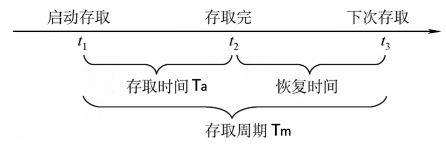  
如图所示，存取时间Ta表示读出时间和写入时间，存储周期Tm表示读写的周期。需要一块冷却时间。

## 3. 随机存储器RAM
分为SRAM和DRAM，即dynamic RAM和static RAM。叫做动态RAM和静态RAM。

### 3.1 DRAM
### MOS型随机存储器
MOS很简单，高电压导通，低电压断开  
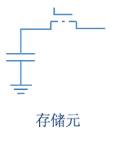
- 读时,给MOS高电压,电容向外导电,根据电容原先高低电平决定1/0
- 写时,给MOS高电压,外边给高电压写1,给低电压写0,这也解释了为什么存储周期还要冷却
- 不用时,MOS给低电压保持
#### 3.1.1 六管静态存储器
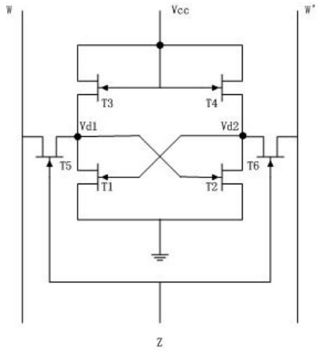  
三个脚的是MOS,只要W高电压.W'低电压就是1,反之为0。此时T2导通，T1不导通
#### 3.1.2 四管静态存储器
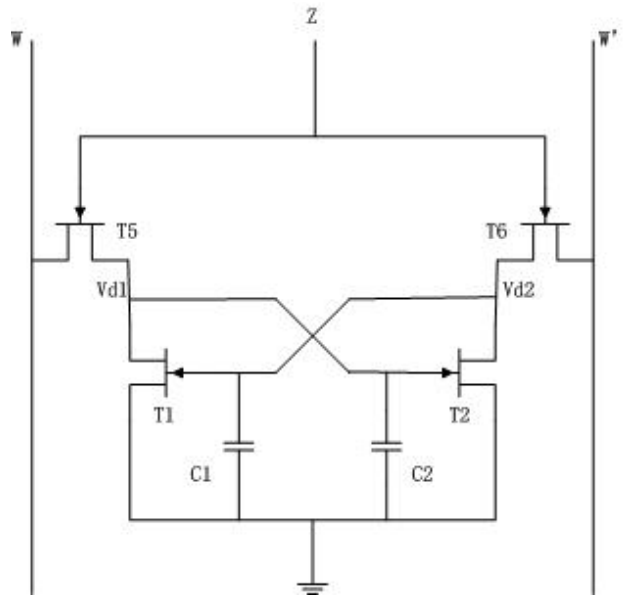  
跟六管情况一样
#### 3.1.3 刷新过程
MOS管的是动态存储器，由于会漏电，所以要不时地将W和W'置于高电平给电容充电。

## 4. ROM只读存储器
历史原因，叫ROM，现在的ROM主要是不易失性
- MROM -- 掩模式只读存储器  
生产完成不可重写
- PROM -- 编程只读存储器  
写一次程序后不可重写
- EPROM -- 可擦除可编程只读存储器  
可擦除，多次重写
- UVEPROM -- 用紫外线照射  
照射完后全部擦除
- EEPROM -- 电擦除  
通电擦除特定的字
- Flash Memory -- 闪速存储器
主要就是U盘什么的
- SSD -- 固态硬盘  
SSD逐渐替代传统的机械硬盘

## 5. 主存与CPU的连接
### 5.1 存储器芯片的基本结构
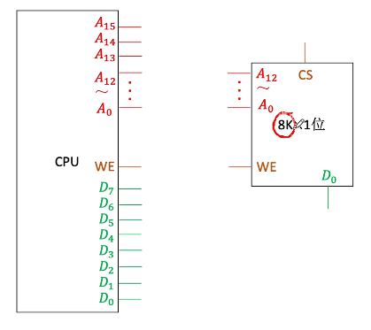  
芯片有个片选信号C̅S̅，表示低电平的时候，才读取这块芯片内容。  
CPU上有个W̅R̅，给出低电平时是写，给出高电平时是读。(总体为1时看左边，为0时看右边)
### 5.2 位扩展
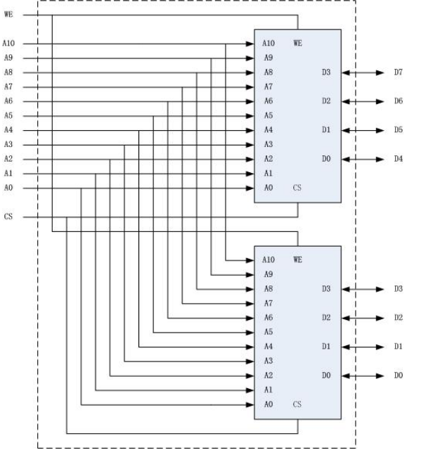  
位扩展需要两个芯片地址字长相等，同一节的数据共用一个地址线，一个芯片提供几个数位，另一个芯片提供几个数位。
### 5.3 字扩展
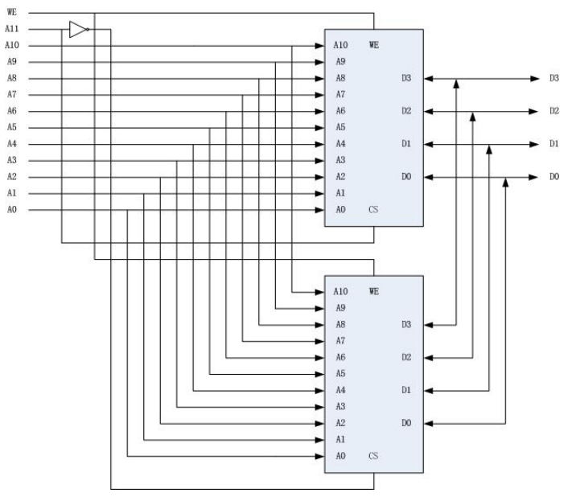  
#### 5.3.1 线选法
#### 5.3.2 译码片选法
当地址字长大于芯片的所需地址字长时，多出的地址线可以连接译码器进行选择，从而实现字扩展，扩大了存储空间。WE信号为1时，才会读取该芯片的数据。
### 5.4 字位同时扩展
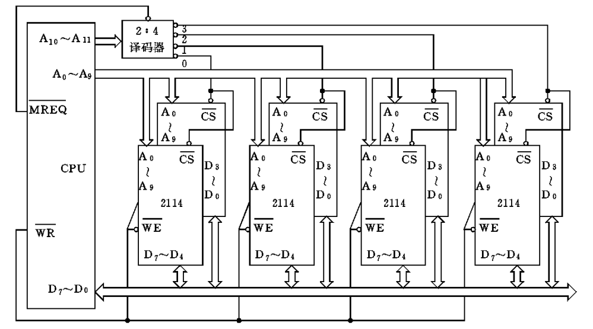  
一前一后平行站位的是位扩展，扩大了字长。  
而一个平面上的芯片则是字扩展，由片选法来选择要读取的芯片。

## 6. 多存储体存储器及交叉存取
前面讨论的都是一个存储体的，现在如果有多个存储体，就需要交叉存取。  
CPU会给出一个地址，去访问存储体。CPU->xxxxxxxxxxxx  
1. **按高位地址划分**: 取出高几位来决定是哪个存储体 CPU->**xx**xxxxxxxxxx 
2. **按低位地址划分**: 取出低几位来决定是哪个存储体 CPU->xxxxxxxxxx**xx** 
### 6.1 高位地址划分
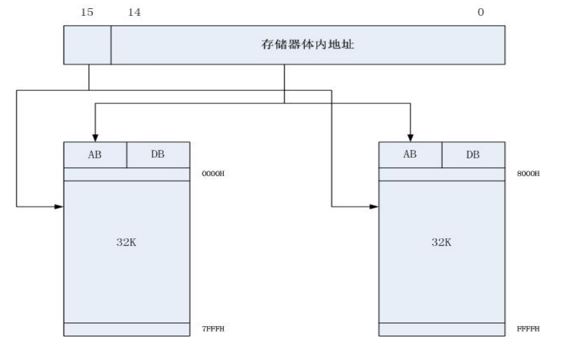  
### 6.2 低位地址划分
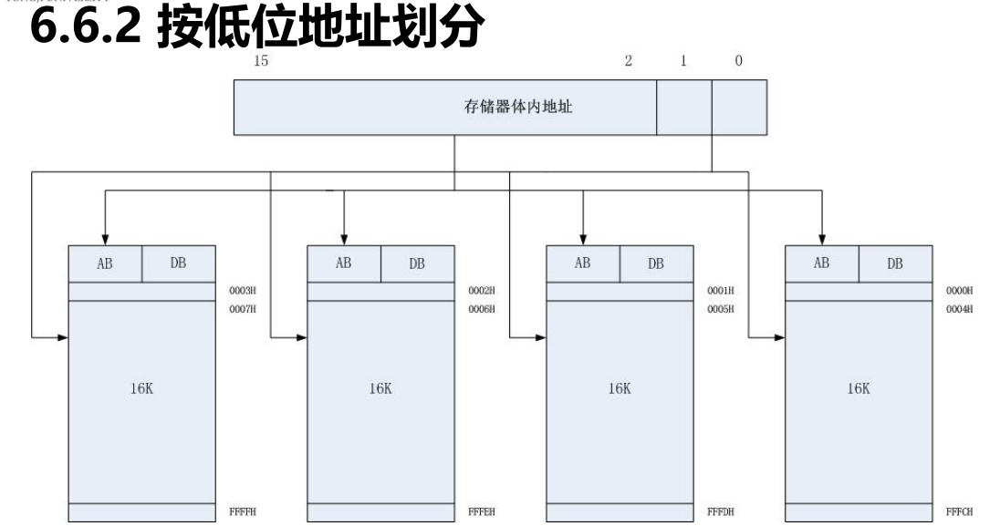
### 6.3 按低位划分（交叉编址）有三个问题：
1. 模块数必须是2的整数幂，否则，地址不连续。
2. 任一模块失效就会造成地址空间的缺陷而导致整个程序无法运行。
3. 不利于存储器模块数的增量式扩展。
### 6.4 多体存储体访问控制
有两种访问方式：  
1. **同时访问**：所有模块同时启动一次存储周期,能一次提供多个数据或多条指令
2. **交叉访问**：M个模块按一定的顺序轮流启动各自的访问周期,最适合用于以流水线方式向中央处理器
提供指令和数据。
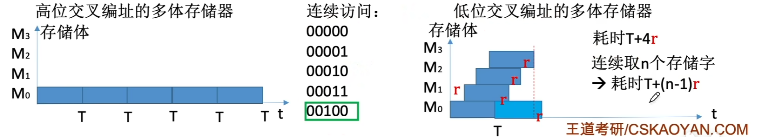

## 7. Cache
### 7.1 Cache存储器工作原理
**CPU -> Cache -> 主存**  
CPU具有空间局限性和时间局限性，表现为在最近的未来要用到的信息，可能在现在使用的信息在存储空间上相邻或者是现在正在使用的信息。  
故由局部性定理，将CPU目前访问地址周围部分数据放到Cache中即可快速访问
### 7.2 命中率H
**命中率=访问信息在Cache中的次数/访问Cache的总次数**  
其实就是你要访问信息存在于Cache中的比率。
**缺失率=访问信息不在Cache中的次数/访问Cache的总次数**  
- tc 访问一次Cache所需时间
- tm 访问一次主存所需时间  
平均访问时间的公式t为

$ t = H \cdot tc + (1 - H) \cdot tm $  

或者

$ t = H \cdot tc + (1 - H) \cdot (tm + tc) $

具体看的是题目要求，是否Cache和主存同时访问
### 7.3 Cache地址映像
Cache 基于"局域性定理"，主存通过**分块**的方式存储，并且将其映射到Cache上。  
Cache共有三种映射方式：  
- **全相联映射**
- **直接映射**
- **组相联映射**
#### 7.3.1 全相联映射
最灵活但成本最高  
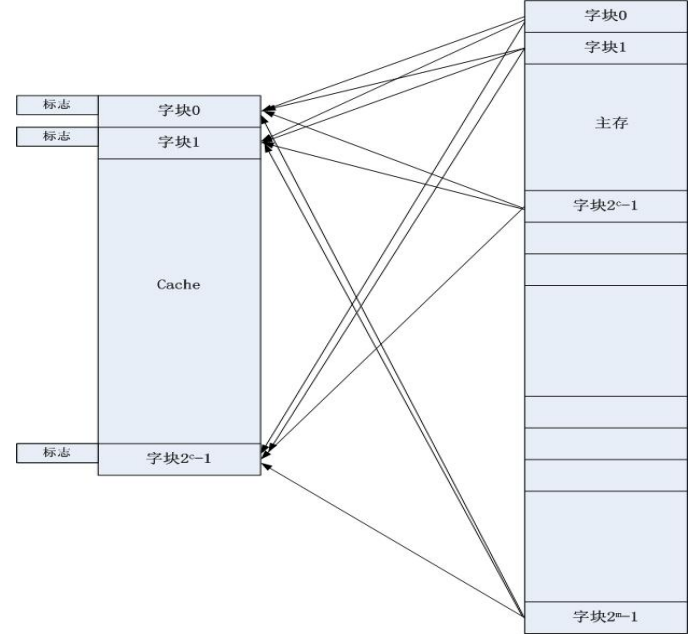  
就是Cache上每块都可以由任意主存块映射。  
#### 7.3.2 直接映射
直接映射就是将取模后的哈希函数  
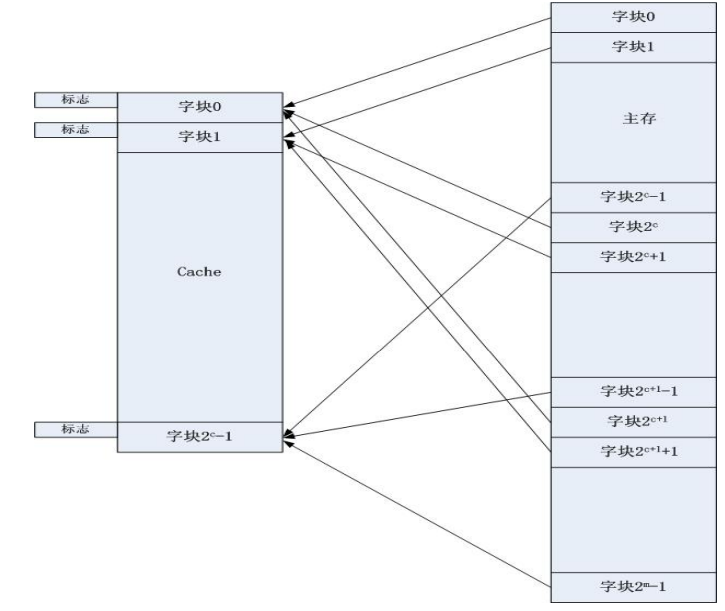  

$ j = i \mod 2^{c} $

- $2^{c}$ 是Cache分块数
- $i$ 是主存地址块
- $j$ 是映射到Cache地址块
#### 7.3.3 组相联映射
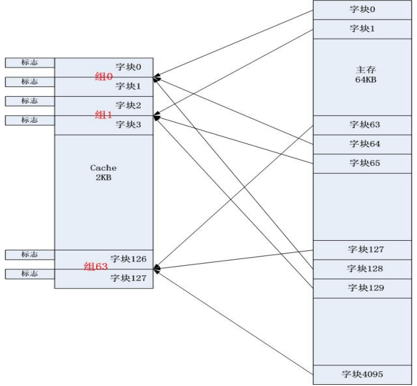  
是前两种方式的折中  
- 先分组，用 mod 映射
- 组内再随机映射
### 7.4 Cache替换算法  
- **FIFO算法**
- **LRU算法**
#### 7.4.1 FIFO算法
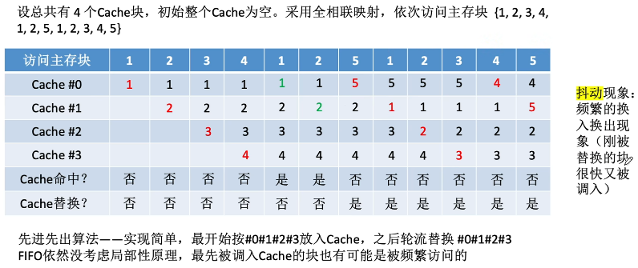  
只有当Cache满时替换，在这组数据块中，先进来的先被替换走
- **缺陷**：FIFO没有考虑到局域性定理，先进来的数据块可能是使用最频繁的，因此这种算法并不科学，会出现**抖动现象**。
#### 7.4.2 LRU算法
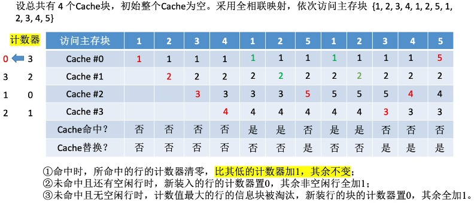  
比普通的Cache，运用该算法需要多一个计数器。  
- **优化**：规则一中，只让比其低的计数器加一。这是因为比其大的计数器是否加一都能保持排名不变，不加反而能减少成本。
## 8. 虚拟存储器
这部分，**【虚拟存储器】https://www.bilibili.com/video/BV14H4y1u7bL?p=2&vd_source=51be30795fbdc362785bf885135425fe**那个Beokayy_姐姐讲的最好
### 8.1 虚拟存储技术
由**局部性定理**可知，程序运行不需要全部导入内存，只需少数页面/段即可运行。如果需要访问页/段不在内存中，再发出中断请求。  
这个**页/段**的处理方式被称为**主存存储管理方式**
### 8.2 分页思想
- 将主存分为**固定长**且**较小**的存储块，称为**页面**
- 将进程分为**固定长**的程序块，称为**页**
- **页 = 页面**，每个页都有**虚拟/逻辑地址**和**物理地址**  
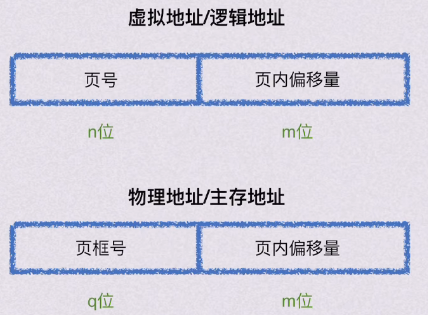
#### 8.2.1 虚拟/逻辑地址
- 在程序中的数据，相对于该程序的地址，称为**虚拟/逻辑地址**  
- 高位用作页号，如逻辑地址为**01**00000010的数据，在第一页。
#### 8.2.2 物理地址
- 物理地址由虚拟地址向主存映射得来，由于是整块映射，所以页内偏移量不变，页号映射为页面号
#### 8.2.3 页表
- 页表是由操作系统维护的数据结构，用于存储页号和页面号的映射关系  
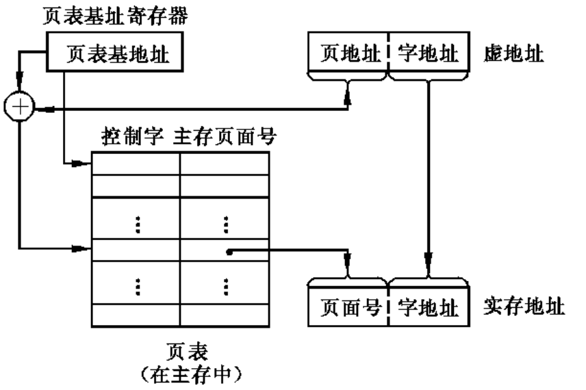
- **页表使用方式**：知道逻辑地址 -> 查表 -> 用页面号替换页号 -> 得到物理地址
- **控制字**(装入位,修改位,替换控制位)
- **装入位**：0表示未存入主存，1表示已存入主存
- **修改位**：0表示页面内容无修改，1表示页面内容有修改
- **替换控制位**：指出需替换的页。
#### 8.2.4 页这种方式的优缺点
- 优点：充分利用主存空间
- 缺点：进程的所有页都丢入，造成空间浪费。页不是逻辑上独立的实体，所以处理、保护和共享都不如**段**。
### 8.3 分段思想
程序员将一个进程分成多个**独立的**部分，就是**段**
#### 8.3.1 虚拟/逻辑地址
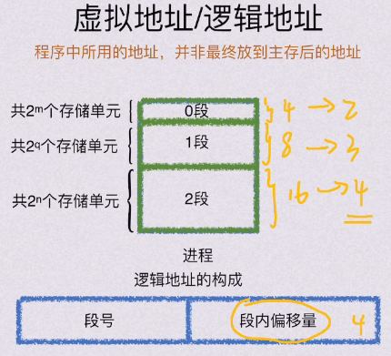  
- 段的信息不规则，电脑无法判断，因此，段号和段内偏移量都由程序员给出
- **段号**：进程的段的最大数量
- **段内偏移量**：进程的所需最大存储空间的段，决定段内偏移量的位数。
#### 8.3.2 物理地址
段式结构特殊，因此物理地址不需要划分字段。  
需要知道的是：
- **段在主存内的基地址**
- **段长度**
#### 8.3.3 段表
段表是就**某一进程**提出的
- **段号**：在该进程逻辑段号
- **段起点**：从主存中的哪开始装
- **装入位**：1表示该段在主存中，0表示未装入
- **段长度**：段落长度  
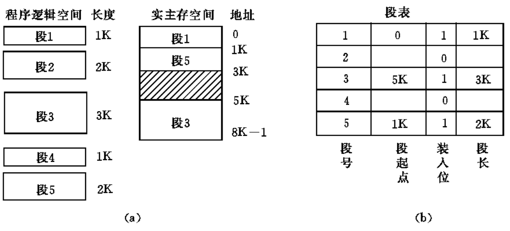
### 8.4 段页式思想
结合了分段和分页
#### 8.4.1 逻辑/虚拟地址
先将一个进程分成多段，然后段内分页。
- **基号D**：哪一个用户的程序
- **段号**：这属于进程的第几段
- **段内页号**：相对于该段，是第几页
- **页内偏移量**：相对于该页，是第几个字节  
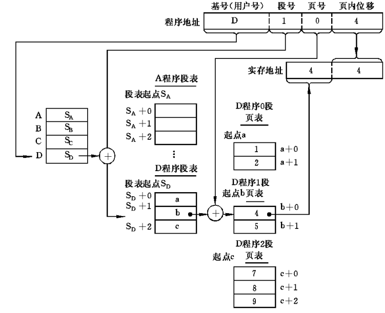
#### 8.4.2 物理地址
和分页的物理地址一致
- 页面号：属于主存的第几页
- 页内偏移量：属于该页的第几个字节

</details>
